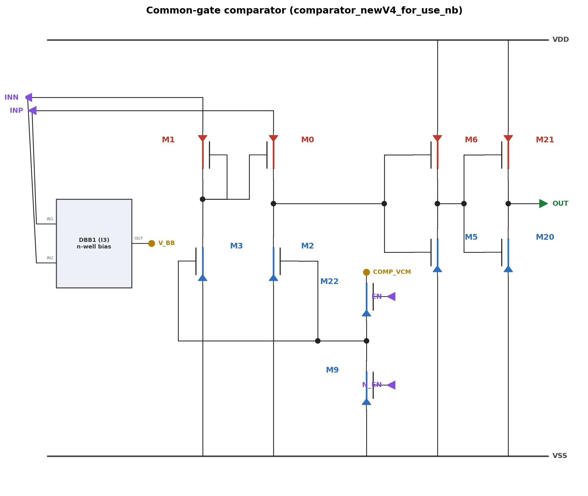
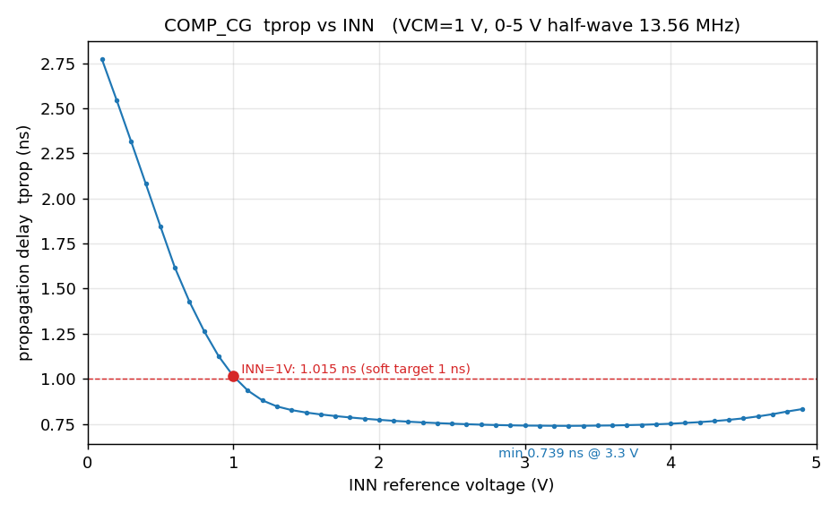
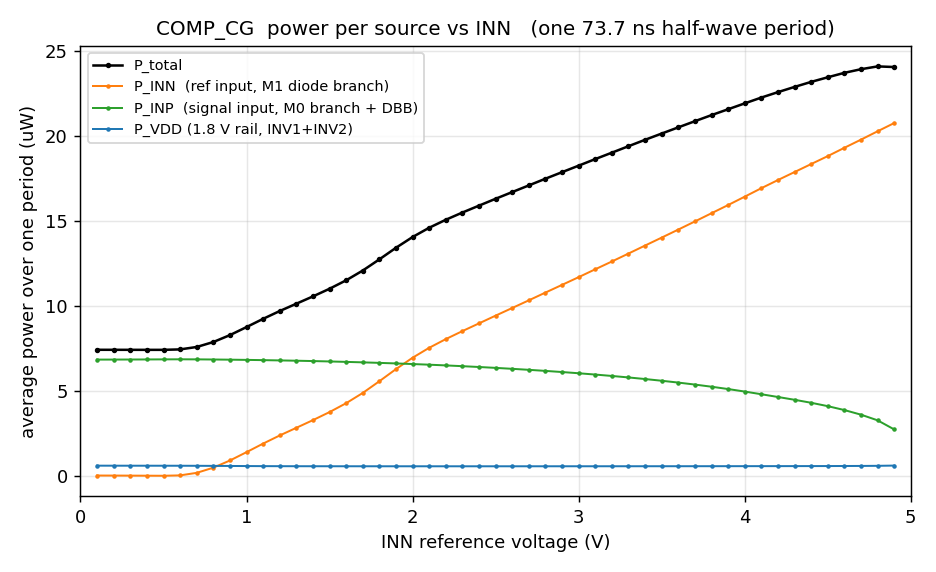

# COMP_CG — 共栅比较器（0–5V 输入，1.8V 供电）

> Virtuoso cell：**test/COMP_CG**（已建成并与参考 netlist 逐端子对拍验证）
> 参考来源：`test_rect/comparator_newV4_for_use_nb`（流片验证过的 V4）
> 用途：13.56 MHz 无线充电整流系统中，检测整流正半波越过参考电压的瞬间



---

## 1. 工作原理

信号链：**PMOS 共栅差分对 → NMOS 电流源负载 → 两级反相器 → OUT**

1. **共栅输入级（M0/M1，pmos5v）**
   输入从**源极**进入（INP→M0.S，INN→M1.S），两管栅极共接于 net78。
   M1 二极管接法（G=D），把 net78 钳在 `INN − |VGS1|`；于是 M0 的源-栅电压
   `VSG0 = INP − net78 = (INP − INN) + |VGS1|`。
   **INP > INN 时 M0 导通增强 → COMP_OUT 被拉向 INP（高）；反之 M2 把 COMP_OUT 拉地（低）。**
   共栅结构没有栅氧直接暴露给 0-5V 输入，5V 厚栅管 + n-well 追踪偏置使 1.8V 系统能处理 5V 摆幅。

2. **n-well 偏置网络（I3=DBB1 + M10/M11）**
   DBB1 是交叉耦合 PMOS max-selector：`V_BB ≈ max(INP, INN)`，作为 M0/M1 的 n-well
   偏置，防止源-阱二极管在大输入摆幅下正偏。M10/M11（G=D=B=V_BB）辅助充电。

3. **尾电流偏置（M22/M9 + COMP_VCM）**
   EN=1 时 M22（NMOS 传输管）把外部 COMP_VCM 传到 V_BN，设定 M2/M3 电流源
   （每支路 ≈4.3 µA @ VCM=1.0V）。N_EN=1 时 M9 把 V_BN 拉地，关断比较器。

4. **输出整形（INV1 5V 管 → INV2 2V 管）**
   COMP_OUT 摆幅可达 ~5V，INV1 用 5V 管承受；INV1 故意做偏斜
   （M5 下拉 0.88µ 强 / M6 上拉 0.22µ 弱）加快对 COMP_OUT 上升沿的响应。
   INV2 用 2V 管把信号整形为干净的 0/1.8V 数字输出。

## 2. 器件尺寸

CDF 中 w 为**单指宽**；Spectre netlist 中 w 为**总宽**（详见 §5 注意事项）。

| 器件 | Cell | 单指 W | L | fingers | m | 总有效 W/L | 角色 |
|---|---|---|---|---|---|---|---|
| M0 | pmos5v_mac | 500n | 0.5µ* | 4 | 1 | 2µ/0.5µ | CG 有效输入（S=INP） |
| M1 | pmos5v_mac | 500n | 0.5µ* | 4 | 1 | 2µ/0.5µ | CG 二极管基准（S=INN） |
| M10 | pmos5v_mac | 500n | 0.5µ* | 1 | 2 | 1µ/0.5µ | V_BB 辅助（S=INN） |
| M11 | pmos5v_mac | 500n | 0.5µ* | 1 | 2 | 1µ/0.5µ | V_BB 辅助（S=INP） |
| M2 | nmos5v_mac | 220n | 0.6µ* | 1 | 1 | 0.22µ/0.6µ | 电流源负载（COMP_OUT） |
| M3 | nmos5v_mac | 220n | 0.6µ* | 1 | 1 | 0.22µ/0.6µ | 电流源负载（net78） |
| M5 | nmos5v_mac | 220n | 0.6µ* | 2 | 2 | 0.88µ/0.6µ | INV1 N（强下拉） |
| M6 | pmos5v_mac | 220n | 0.5µ* | 1 | 1 | 0.22µ/0.5µ | INV1 P（弱上拉） |
| M9 | nmos2v_mac | 220n | 180n | 1 | 1 | 0.22µ/0.18µ | 关断开关（G=N_EN） |
| M20 | nmos2v_mac | 220n | 180n | 1 | 1 | 0.22µ/0.18µ | INV2 N |
| M21 | pmos2v_mac | 880n | 180n | 1 | 1 | 0.88µ/0.18µ | INV2 P |
| M22 | nmos2v_mac | 220n | 180n | 1 | 1 | 0.22µ/0.18µ | 使能开关（G=EN） |
| I3 内 M0/M1 | pmos5v_mac | 220n | 0.5µ* | 1 | 1 | 0.22µ/0.5µ | DBB1 max-selector |

\* 5V 管 L 取 CDF 默认值（pmos5v 500n / nmos5v 600n），与参考设计一致。
sizing 已验证：输入对总宽 1µ–4µ 扫描中 **2µ 即最优**（更宽时 COMP_OUT 寄生电容反超 gm 收益）。

端口：INP / INN / EN / N_EN（in），OUT（out），VDD / VSS / COMP_VCM（io）。
V_BB、V_BN、net78、COMP_OUT、MID_INV 为内部 net。

## 3. 性能报告

测试条件：VDD=1.8V，INP=0–5V 正半波 13.56MHz，INN=DC 参考，EN=1.8V，N_EN=0，tt 工艺角。
tprop 定义：INP 上穿 INN 时刻 → OUT 上穿 0.9V 时刻。

### 3.1 COMP_VCM 工作点（@ INN=1V）

| COMP_VCM | tprop | 状态 |
|---|---|---|
| 0.4–0.6 V | — | **卡死**：V_BN < nmos5v 阈值，M2/M3 截止，无法复位 |
| 0.7 V | 2.49 ns | 工作但慢 |
| 0.9 V | 1.08 ns | |
| **1.0 V（推荐）** | **1.015 ns** | 平坦最优区 1.00–1.05V |
| 1.2 V | 1.07 ns | V_BN 被 M22 钳位（≈1.1V），再升无效 |

### 3.2 传播延迟 vs INN（VCM=1.0V，49 点全过）



- INN=1V：**1.015 ns**（软目标 1ns 达标）；谷底 **0.739 ns @ INN=3.3V**
- 最差 2.77 ns @ INN=0.1V（comp_out 高电平≈INP 很低，刚过 INV1 阈值所以翻转慢）
- 全范围 0.1–4.9V 均正常复位 + 满摆幅输出

### 3.3 功耗（单正半波周期 73.7ns 平均，VCM=1.0V）



| 来源 | 数值 | 说明 |
|---|---|---|
| P_INN | 0 → 20.8 µW | **主导项**。M1 二极管支路 ≈4.3µA 恒流从参考端抽取，随 INN 线性增长 |
| P_INP | 6.8 → 2.7 µW | M0 支路 + DBB，半波期间导通 |
| P_VDD | ≈0.55 µW | 仅 INV1/INV2 开关功耗 |
| P_VCM | ≈0 | 纯栅负载 |
| **总计** | **7.4 µW（INN=0.1V）→ 24 µW（INN=4.9V）** | |

### 3.4 系统集成注意（工作区边界）

1. **COMP_VCM 必须 ≥0.8V**，推荐 1.0V；<0.7V 比较器卡死。>1.1V 无意义（M22 NMOS 钳位）。
2. **INN 参考源必须能灌 ≈4.3µA**——本比较器功耗大头直接从输入端抽，不走 VDD。
3. INN<0.6V 区域：二极管支路饿死，tprop 退化至 2–3ns，且 P_INN≈0（同一根源）。

## 4. 文件清单与复现

| 文件 | 作用 |
|---|---|
| `build_comp.py` | 在 Virtuoso 中重建 test/COMP_CG schematic（含 sizing） |
| `run_comp.py` | Spectre testbench：`vcm`/`inn`/`win`/`pwr`/`one` 五种模式 |
| `comp_schematic.yaml` | 电路图权威源（NL→YAML→SVG 流程） |
| `comp_figs.py` | 从 comp_char.json 出 delay/power 两图 |
| `comp_char.json` | 49 点 INN 扫描数据（tprop + 分源功耗） |
| `comp/` | Spectre 原始输出（psfascii） |
| `v4_orig_netlist.scs` | **原版**（test/COMP_V4_ORIG）的 si 真值网表（含 CDF 版图参数） |
| `run_comp_orig.py` | 用 si 网表跑原版，同激励同测量 → comp_orig_char.json |
| `comp_orig_char.json` | 原版 49 点表征（复刻保真度：tprop 差 ~2%，功耗差 ~6%） |

```powershell
# 重建 schematic（需 bridge 在线）
.venv/Scripts/python.exe ota5t/comp_cg/build_comp.py
# 重跑表征（COMP_VCM 扫描 / INN+功耗全扫描）
.venv/Scripts/python.exe ota5t/comp_cg/run_comp.py vcm
.venv/Scripts/python.exe ota5t/comp_cg/run_comp.py pwr 1.0
# 重渲染图
.venv/Scripts/python.exe ota5t/tools/render_schematic.py ota5t/comp_cg/comp_schematic.yaml
.venv/Scripts/python.exe ota5t/comp_cg/comp_figs.py
```

## 5. 注意事项（踩坑记录）

- **tsmc18 `_mac` 宏的 w 语义**：Spectre netlist 中 `w` = 总宽（宏内 wef=w/nf 参与 bin
  选择），CDF 存的是单指宽。弄反会报 CMI-2440（只在 nf>1 的管子上爆）。
- `multi` = CDF 的 simM；`totalM = fingers × simM` 是派生值，不要直接设。
- run_comp.py 的小 sweep 会复用 work 目录，旧的大 sweep 残留文件会被解析成多余点
  （脚本已加防护，跑前删 `comp/<tag>` 更稳）。
