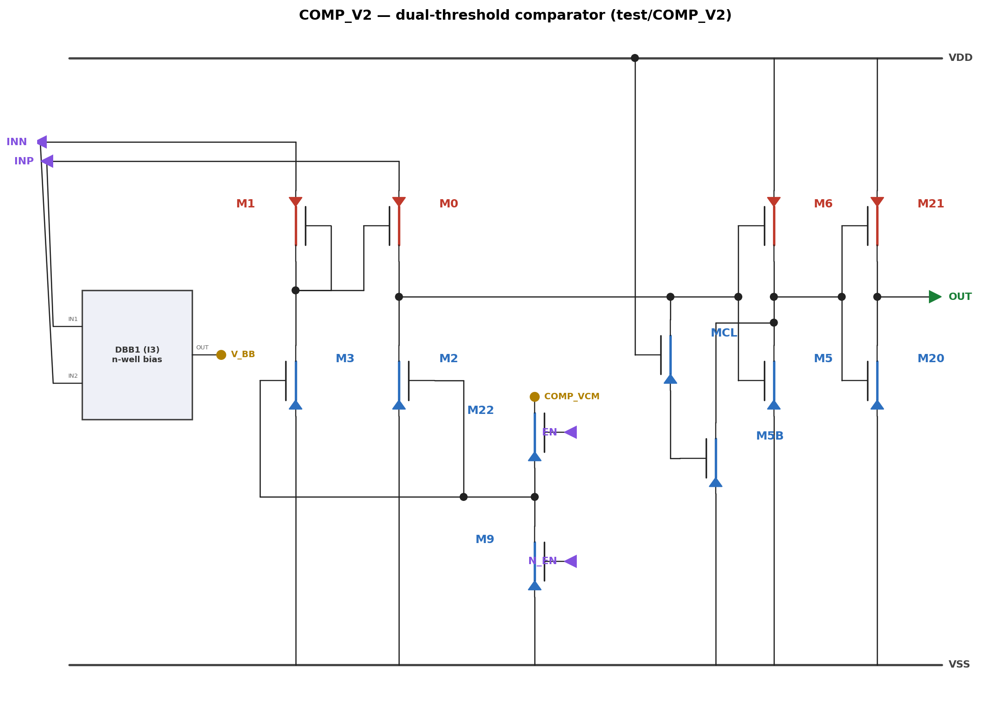
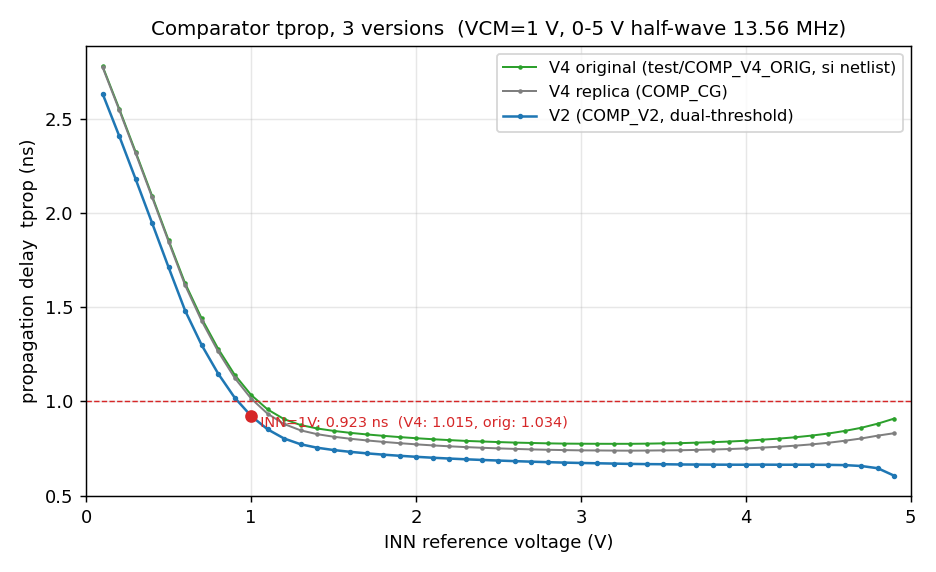
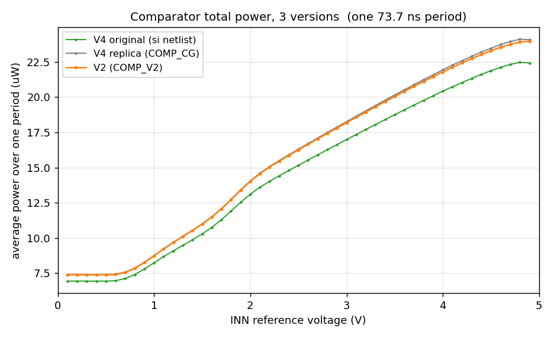

# COMP_V2 — 双阈值共栅比较器（V4 的提速改版）

> Virtuoso cell：**test/COMP_V2**（已建成并逐端子验证）
> 基线：test/COMP_CG（V4 复刻版），设计任务：允许功耗 +30%，降低传播延迟，严守耐压
> **结果：全范围更快（−5% ～ −27%），功耗持平（+0%，30% 预算未动用）**



---

## 1. 架构改动与工作原理

**前端完全不变**（M0/M1 共栅对、M2/M3 电流源负载、DBB1、EN 开关）。这是分析后的
刻意决定：M2 恒流负载会把 M0 在 INP 高时推入线性区限流（comp_out ≈ INP），这是
P_INP 有界的根本机制——任何把 M0 漏极钳低的改法（镜像/cascode 折叠）都会让 M0
在 INP=5V 时以饱和电流（数百 µA）失控放电，功耗爆炸。实测验证过。

**改动全部在判决链——双阈值并联检测**：

```
                    ┌─ 路径 A：M5  (nmos5v, G=COMP_OUT)  阈值~0.75V，
COMP_OUT ──┬────────┤    栅压跟随 comp_out → INP，后期 overdrive 无限增长
           │        └─ 共同下拉 MID
        MCL(G=VDD)  ┌─ 路径 B：M5B (nmos2v, G=YC)  阈值~0.45V，L=0.18µ
           │        │    经 MCL 钳位保护，提前 0.3V 开火
           YC ──────┘
MID ── INV2 (M20/M21) ── OUT
```

- **MCL**（nmos5v 传输钳位，G=VDD）：`YC = min(COMP_OUT, VDD−Vth5(body) ≈ 0.97V)`，
  让 2V 薄栅器件安全地"看"5V 摆幅节点。双向导通（comp_out 下降时也拉 YC 复位）。
- **路径 B 先开火**（0.45V vs 0.75V），**路径 A 后程发力**（comp_out 升向 INP 时
  其栅过驱动持续增大，这是 V4 高 INN 端快的真正原因——保留它）。两路电流叠加。
- **M6**（pmos5v，G=COMP_OUT）：comp_out 回零时上拉复位 MID。
- comp_out 节点轻量化：判决器件全部取最小宽（见 §3 调优记录），该节点电容直接
  决定 stage-1 压摆速度 = tprop 的大头。

### 耐压审计（INP/INN 0–5V，VDD=1.8V）

| 节点/器件 | 最大应力 | 器件选择 |
|---|---|---|
| COMP_OUT（摆到 ~INP=5V） | 5V | 只接 5V 器件：M0/M2 漏、MCL 漏、M5/M6 栅 |
| YC | ≤0.97V（MCL 钳位保证） | M5B (2V) 栅安全 |
| MID / OUT | ≤1.8V | 2V 器件 |
| MCL 的 Vgd | 1.8−5 = −3.2V | 5V 厚栅，额定内 |
| net78 / V_BB / 输入 | ≤5V | 全 5V 器件 + DBB n-well 追踪（同 V4） |

## 2. 器件尺寸（与 V4 的差异加粗）

| 器件 | Cell | 单指 W | L | fingers/m | 角色 |
|---|---|---|---|---|---|
| M0/M1 | pmos5v_mac | 500n | 0.5µ | nf=4 | CG 对（同 V4） |
| M10/M11 | pmos5v_mac | 500n | 0.5µ | m=2 | V_BB 辅助（同 V4） |
| M2/M3 | nmos5v_mac | 220n | 0.6µ | — | 电流源负载（同 V4） |
| **MCL** | **nmos5v_mac** | **220n** | **0.6µ** | — | **新增：传输钳位** |
| **M5** | nmos5v_mac | 220n | 0.6µ | **nf=1**（V4 为 0.88µ 等效） | 路径 A（减容 4×） |
| **M5B** | **nmos2v_mac** | **220n** | **180n** | — | **新增：路径 B** |
| M6 | pmos5v_mac | 220n | 0.5µ | — | MID 复位（同 V4） |
| M20/M21 | nmos/pmos2v | 220n/880n | 180n | — | INV2（同 V4） |
| M9/M22 | nmos2v_mac | 220n | 180n | — | EN 开关（同 V4） |

端口与 V4 完全相同：INP/INN/EN/N_EN(in)、OUT(out)、VDD/VSS/COMP_VCM(io)。

## 3. 性能报告（tt，VDD=1.8V，13.56MHz 正半波）

### vs V4 全范围对比（COMP_VCM=1.0V）




| 指标 | V4 | **V2** | 改善 |
|---|---|---|---|
| tprop @ INN=1V | 1.015 ns | **0.923 ns** | −9.1% |
| tprop 平台（INN 2-4V） | 0.74 ns | **0.66-0.70 ns** | −9% |
| tprop @ INN=4.9V | 0.831 ns | **0.606 ns** | −27% |
| tprop @ INN=0.1V | 2.771 ns | 2.631 ns | −5%（输入级固有限制，见 §4） |
| P_tot @ INN=1V | 8.75 µW | **8.74 µW** | 持平（+30% 预算未动用） |
| P_tot 全范围 | 7.4–24.1 µW | 7.4–24.0 µW | 持平 |

**低功耗工作点**：VCM=0.9V 时 0.974ns @ 5.57µW——比 V4 默认点还快 4%，功耗省 36%。

### 调优记录（关键路径 = comp_out 节点电容最小化）

| 旋钮 | 扫描 | 最优 | 说明 |
|---|---|---|---|
| wcl (MCL) | 0.22-1.76µ | **0.22µ** | 漏结挂在 comp_out，越小越快（1.021→0.984） |
| w5a (M5) | 0.22-0.88µ | **0.22µ** | 同上（0.984→0.939），双路径下无需大管 |
| w5n (M5B) | 0.22-0.88µ | **0.22µ** | 栅挂在 YC，轻=MCL 跟随快（0.939→0.923） |
| w21 / nf0 / vcm↑ | — | 维持 V4 值 | 全部变差或白烧功耗 |

## 4. 设计探索记录（否定结果，防止重蹈）

1. **纯 2V 钳位判决链（V2.0）= 1.162ns，比 V4 慢**。逐级解剖显示 V4 的 5V INV1
   只占 ~0.17ns——它的栅过驱动随 comp_out 增长，后期极快；钳位方案把判决管 OD
   锁死在 0.5V，丢了这个机制。→ 由此诞生双路径方案。
2. **预充地板**（M_PC 把 comp_out 低电平抬到 ~0.2V）：仅 −40ps，+1.5µW，且引入
   输入失调 → 弃用。
3. **MID 正反馈**（pmos 反馈到 YC）：DC 双稳态，上电可能锁死在错误状态 → 弃用。
   （反馈到 comp_out 更不行：会破坏 M0 线性区限流，INP=5V 时功耗失控。）
4. **低 INN 端（<0.6V）的 2-2.6ns 是输入级固有**：M1 二极管支路饿死（VSG1 < |Vth5p|），
   net78≈0，M0 等 INP 爬过自身阈值 ~0.85V 才导通——判决链阈值再低也无济于事
   （实测 V2 在 0.1V 只快 36ps）。要破需互补输入对，另立项目。
5. M0 的 nf=2（减漏结周长）反而更慢——单条漏极条的串联电阻代价更大。

## 5. 文件清单与复现

| 文件 | 作用 |
|---|---|
| `build_comp_v2.py` | 重建 test/COMP_V2 schematic（含 sizing） |
| `run_comp_v2.py` | testbench：one/vcm/sw <param>/inn/pwr 模式 + k=v 旋钮覆盖 |
| `comp_v2_schematic.yaml` | 电路图权威源 |
| `comp_v2_char.json` | 49 点 INN 表征数据 |
| `comp_v2_figs.py` | V2 vs V4 对比图（delay/power） |
| `sim/` | Spectre 原始输出 |

```powershell
.venv/Scripts/python.exe ota5t/comp_v2/build_comp_v2.py        # 重建 schematic
.venv/Scripts/python.exe ota5t/comp_v2/run_comp_v2.py pwr 1.0  # 全 INN 表征
.venv/Scripts/python.exe ota5t/comp_v2/run_comp_v2.py sw wcl 0.22u 0.44u  # 任意旋钮扫描
.venv/Scripts/python.exe ota5t/tools/render_schematic.py ota5t/comp_v2/comp_v2_schematic.yaml
.venv/Scripts/python.exe ota5t/comp_v2/comp_v2_figs.py
```
