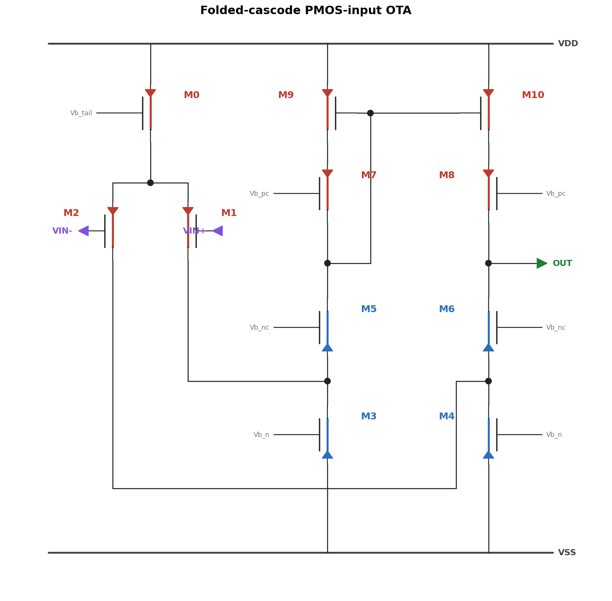
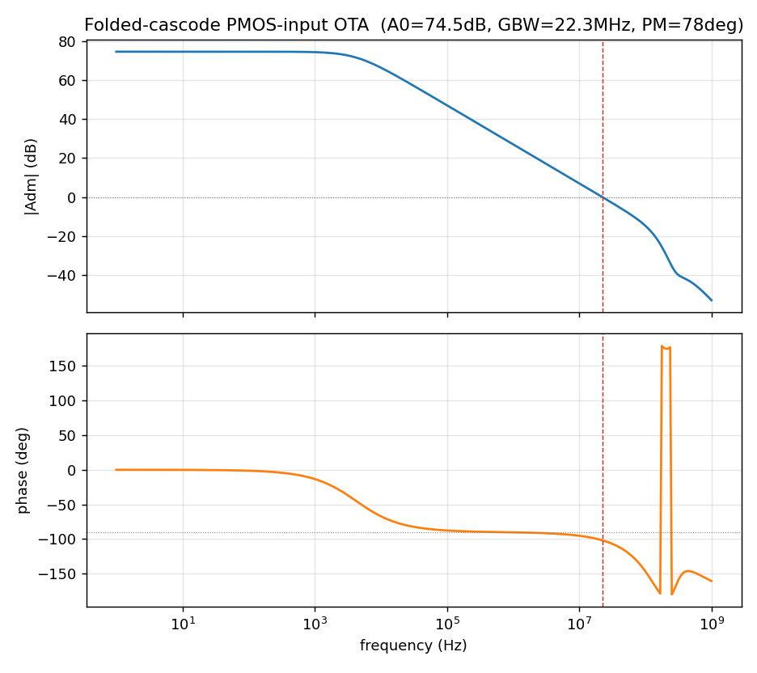

# FC_OTA — 折叠共源共栅 PMOS 输入 OTA（1.8V）

> 状态：**Spectre netlist 级设计**（fc_ota.py 内生成 netlist；Virtuoso schematic 未建）
> 工艺：tsmc18 BCD gen2 1.8V 核心管，tt 角，理想电压源偏置
> 来源：参考论文 IDAC clamp OTA——PMOS 输入以支持**极低输入共模（Vcm=0.3V）**



---

## 1. 工作原理

折叠共源共栅（folded cascode），单端输出：

1. **PMOS 输入对（M1/M2）+ PMOS 尾管（M0）**：选 PMOS 输入是为了让输入共模可以
   低至 0.3V（NMOS 输入对在低共模下尾管没有空间）。差分电流从输入对漏极流出。
2. **折叠节点（nA/nB）**：输入对漏极接到 NMOS 底部电流沉（M3/M4，G=Vb_n）的漏极，
   信号电流在此"折叠"换向，流入共源共栅支路。
3. **NMOS 共源共栅（M5/M6，G=Vb_nc）**：把折叠电流送上去，同时把输出与折叠节点
   隔离（提升输出阻抗）。
4. **PMOS 共源共栅电流镜负载（M7–M10，G=Vb_pc / nA2 二极管）**：cascode 镜像把
   左支路电流翻到右支路，单端输出在 OUT（M6 漏 = M8 漏）。
5. 增益：`A0 ≈ gm1 · [ (gm6·ro6·ro4) ∥ (gm8·ro8·ro10) ]` ——cascode 输出阻抗使
   单级即得 ~74dB，比五管 OTA 高 35dB。
6. 输出经 huge-L 反馈自偏置到 `Vcm + Voff = 0.9V`（表征技巧，同 OTA_5T）。

## 2. 器件尺寸与偏置

| 器件 | 类型 | W/L | 角色 |
|---|---|---|---|
| M1, M2 | pch_mac | 3µ/1µ | PMOS 输入对 |
| M0 | pch_mac | 4µ/1µ | 尾电流源（G=Vb_tail） |
| M3, M4 | nch_mac | 1µ/1µ | 底部电流沉（G=Vb_n） |
| M5, M6 | nch_mac | 1µ/0.5µ | NMOS 共源共栅（G=Vb_nc） |
| M7–M10 | pch_mac | 2µ/0.5µ | PMOS 共源共栅 + 镜负载（nA2 二极管定栅） |

| 偏置/条件 | 值 |
|---|---|
| VDD | 1.8 V |
| Vcm（输入共模） | **0.30 V**（设计点：极低共模） |
| Vb_tail / Vb_n / Vb_nc / Vb_pc | 1.30 / 0.52 / 0.90 / 0.95 V（理想源） |
| 输出直流点 | ≈0.9 V（mid-rail） |
| CL | 50 fF |
| Itail | 0.91 µA |

## 3. 性能报告（2026-06-11 重跑确认）

| 指标 | 值 | 对比 OTA_5T |
|---|---|---|
| 直流增益 A0 | **74.5 dB** | +35 dB |
| 单位增益带宽 GBW | **22.3 MHz** | 1.3× |
| 相位裕度 PM | **78°** | 单极点主导 |
| PSRR(+) @DC | 60 dB | +19 dB |
| CMRR @DC | >120 dB | 匹配仿真触底；实际由失配决定（需 MC） |
| Itail | 0.91 µA | 1/22（低功耗设计点） |
| 功耗（估） | ≈3.3 µW | 1/11 |

低功耗 + 高增益 + 低输入共模——FoM 上对五管 OTA 全面占优，代价是需要 4 路偏置电压
（实际系统需偏置电路生成）和更小的输出摆幅（cascode 堆叠占 headroom）。



汇总面板（含各管工作点表）：`fc_ota_summary.png`

## 4. 文件清单与复现

| 文件 | 作用 |
|---|---|
| `fc_ota.py` | netlist 生成 + 设计参数字典 P + parse_info（自包含） |
| `fc_characterize.py` | diff/vdd/cm 三次 AC → 指标打印 + 两张 PNG |
| `fc_schematic.yaml` | 电路图**权威源**（用 `tools/render_schematic.py` 渲染） |
| `fc_schematic.py` | 旧版硬编码渲染脚本（保留备查；改图请改 YAML） |
| `fc/`, `fcc/` | Spectre 原始输出（fc_=单跑 gain；fcc_=表征三件套） |

```powershell
.venv/Scripts/python.exe ota5t/fc_ota/fc_characterize.py   # 重跑表征（3 次 Spectre AC）
.venv/Scripts/python.exe ota5t/tools/render_schematic.py ota5t/fc_ota/fc_schematic.yaml  # 重渲染电路图
```

## 5. 待办 / 已知局限

- **尚未建 Virtuoso schematic**（设计停留在 netlist 级；如需流片走 build 脚本仿照
  `ota_5t/build_ota.py` 写）。
- 4 路偏置均为理想源；实际需 wide-swing 偏置电路。
- CMRR/失调需 Monte Carlo；输出摆幅未表征。
