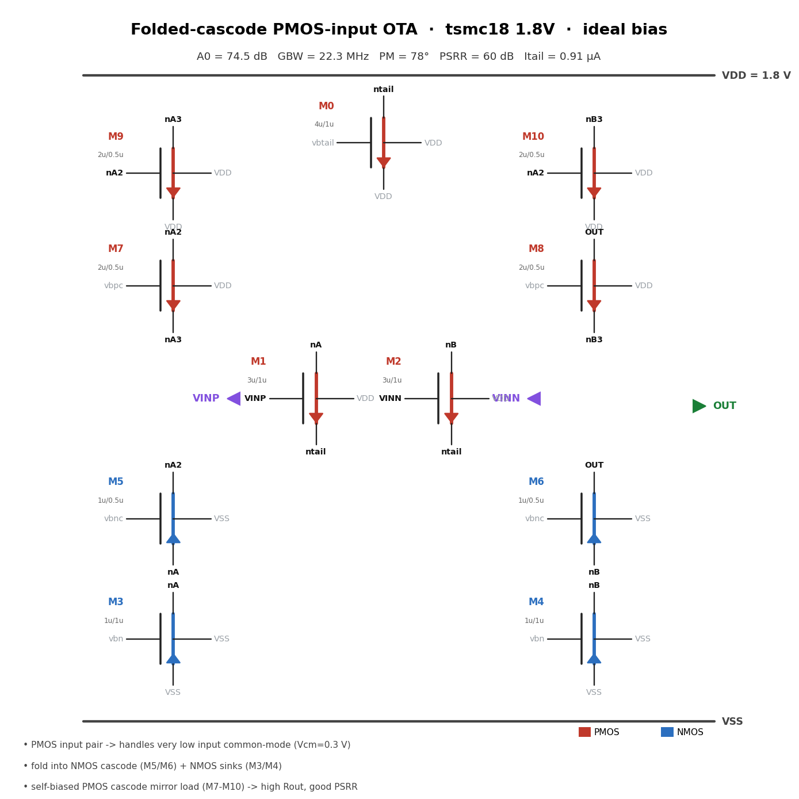
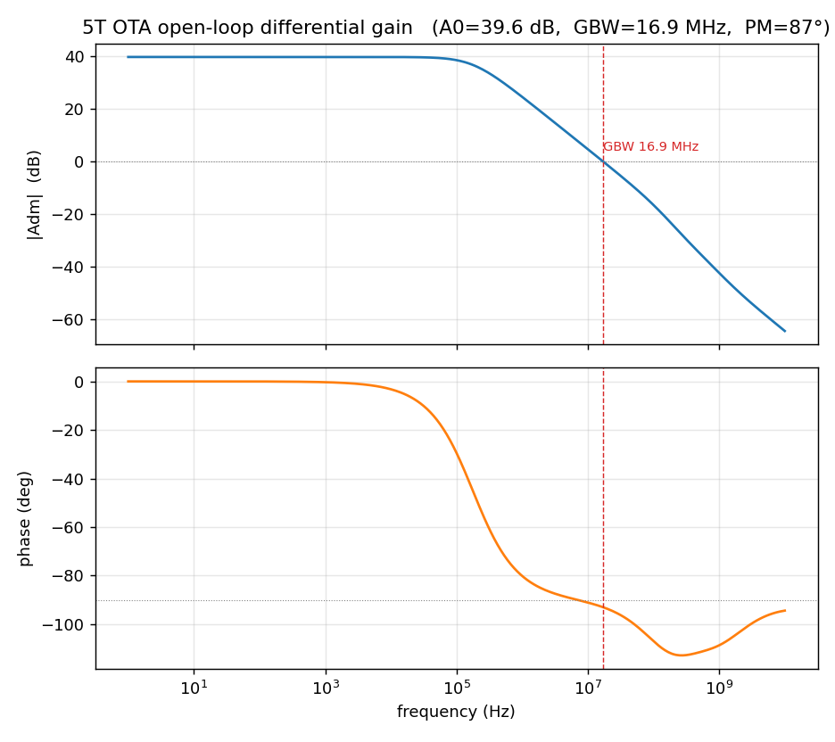
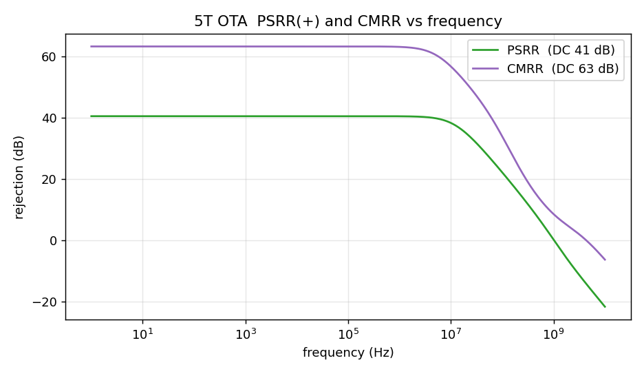

# OTA_5T — 五管跨导放大器（1.8V 核心管）

> Virtuoso cell：**test/OTA_5T**（已建成）
> 工艺：tsmc18 BCD gen2，nch_mac/pch_mac 1.8V 核心管，tt 角
> 角色：本仓库第一个"NL→schematic→Spectre 闭环"的练手器件，也是后续设计的模板



---

## 1. 工作原理

经典五管 OTA：**NMOS 差分输入对 + PMOS 电流镜负载 + NMOS 尾电流源**，单端输出。

1. **差分对（M1/M2）**：VINP/VINN 驱动栅极，源极共接 VTAIL。差分输入电流
   `Δi = gm1·vid/2` 分流到两支路。
2. **电流镜负载（M3/M4）**：M3 二极管接法采样左支路电流，镜像到 M4，
   把双端差分电流折算成单端输出电流——输出处获得完整 `gm1·vid`。
3. **尾电流源（M5）**：VBIAS（0.63V，理想源）设定 `Itail ≈ 20.4 µA`，
   每支路 ~10.2 µA。
4. 增益：`A0 = gm1/(gds2+gds4)`；主极点在输出（CL=1pF），
   GBW ≈ gm1/(2π·CL)。

**表征方法**：开环 AC 用 huge-L/huge-C 反馈网络（L=1T H 直流短路使输出自偏置到
Vcm，AC 下开环），diff/vdd/cm 三种激励分别测 Adm/Add/Acm，得 PSRR=Adm/Add、
CMRR=Adm/Acm。

## 2. 器件尺寸与偏置

| 器件 | Cell | W/L | 角色 |
|---|---|---|---|
| M1, M2 | nch_mac (nmos2v) | 3µ/1µ | 差分输入对 |
| M3, M4 | pch_mac (pmos2v) | 6µ/1µ | 电流镜负载（M3 二极管） |
| M5 | nch_mac (nmos2v) | 5µ/1µ | 尾电流源 |

| 偏置/条件 | 值 |
|---|---|
| VDD | 1.8 V |
| Vcm（输入共模） | 0.9 V |
| VBIAS（尾管栅，理想源） | 0.63 V |
| CL | 1 pF |
| Itail | 20.4 µA |

## 3. 性能报告（char_data.json，tt 角）

| 指标 | 值 |
|---|---|
| 直流增益 A0 | **39.6 dB** |
| -3dB 带宽 | 176.7 kHz |
| 单位增益带宽 GBW | **16.9 MHz** |
| 相位裕度 PM | **87.0°**（单极点特性，1pF 负载） |
| PSRR(+) @DC | 40.6 dB |
| CMRR @DC | 63.4 dB |
| 功耗 | 36.8 µW（20.4µA × 1.8V） |

工作点核查（全部饱和区）：

| 器件 | ID/µA | gm/µS | gm/ID | 本征增益 gm/gds |
|---|---|---|---|---|
| M1/M2 | 10.2 | 108.6/109.0 | 10.7/10.6 | 205/168 |
| M3/M4 | 10.2 | 76.0/76.7 | 7.5/7.5 | 141/158 |
| M5 | 20.4 | 198.1 | 9.7 | 43 |

手算验证：`A0 = gm1/(gds2+gds4) ≈ 108.6µ/1.14µ ≈ 95 → 39.6dB` ✓ 与仿真一致。




汇总面板：`ota5t_summary.png`

## 4. 文件清单与复现

| 文件 | 作用 |
|---|---|
| `build_ota.py` | 在 Virtuoso 中重建 test/OTA_5T schematic |
| `run_ota.py` | 单次 gain 仿真 + op 表 + parse_info（被 characterize 复用） |
| `characterize.py` | diff/vdd/cm 三次 AC → char_data.json |
| `circuit.yaml` | 电路图权威源（yaml_to_fig.py 渲染） |
| `make_figs.py` / `svg_figs.py` | 从 char_data.json 出 PNG / SVG 图 |
| `char/`, `sim/` | Spectre 原始输出 |

```powershell
.venv/Scripts/python.exe ota5t/ota_5t/build_ota.py        # 重建 schematic
.venv/Scripts/python.exe ota5t/ota_5t/characterize.py     # 重跑表征（3 次 Spectre AC）
.venv/Scripts/python.exe ota5t/ota_5t/make_figs.py        # 重出图
.venv/Scripts/python.exe ota5t/ota_5t/yaml_to_fig.py      # 重渲染电路图
```

## 5. 已知局限

- VBIAS 用理想电压源（0.63V），实际系统需电流镜偏置替代。
- 单端输出无输出级，驱动能力受限于 M4/M2 支路电流。
- CMRR 为匹配仿真值，实际受失配限制（需 Monte Carlo 评估）。
