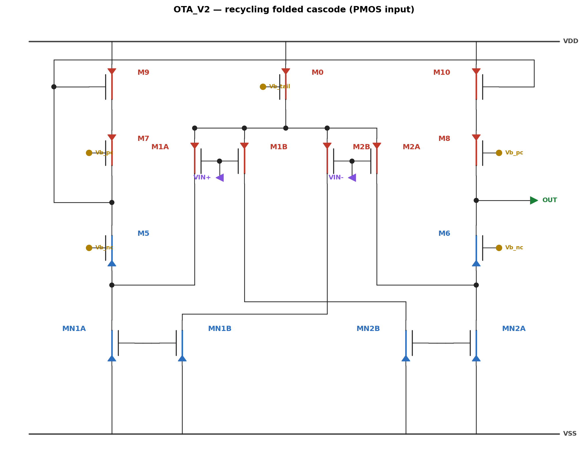
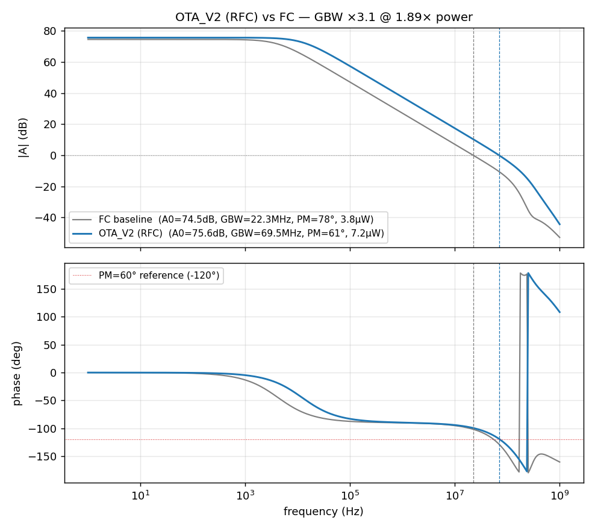

# OTA_V2 — Recycling Folded Cascode（回收型折叠共源共栅，PMOS 输入）

> 状态：**Spectre netlist 级设计**（同 fc_ota；如需 Virtuoso cell 可照 build 脚本模式补建）
> 任务：DC gain 不降、功耗 ≤2×、**GBW 最大化**；保持低输入共模（0.3V）与中等输出摆幅
> **结果：GBW 22.3 → 69.5 MHz（×3.1），A0 还升了 1.1dB，功耗 1.89×（守住 ≤2× 红线）**



---

## 1. 为什么选 RFC（架构决策记录）

约束链条决定架构：摆幅 ±0.5–0.7V → telescopic 出局；低共模 0.3V 硬要求 → 必须
PMOS 输入 → **folded 拓扑保留**。而常规 FC 有个固有浪费：折叠节点的电流沉
（旧 M3/M4）烧掉约一半电源电流却**不贡献任何跨导**。

RFC（Assaad & Silva-Martinez, JSSC 2009）的核心：**把这对"哑"电流沉改造成被
回收输入信号驱动的 1:K 电流镜**——输入对一分为二，一半照旧打折叠节点，另一半
经交叉耦合的镜像放大 K 倍后**同相**注入对侧折叠节点：

```
Gm = gm_half × (1+K)
```

**本设计点的额外洞察**（弱/中反型，gm≈I/(n·VT)）：固定总功耗下 Gm 与 K 几乎
无关，且 **Gm ≈ I_total/2/(n·VT)——RFC 把全部电源电流都转化为有效输入跨导**。
实测同功耗增益 = 2.11µA(FC 总电流)/0.91µA(FC 尾流) ≈ 2.3×，与此模型精确吻合。
K 的真正作用是分配极点结构（镜像节点 vs 折叠节点），实测 K=3 最优。

## 2. 工作原理（逐级）

1. **尾管 M0**（pmos，G=Vb_tail）：从 VDD 给 ntail 提供 2·Ib ≈ 2.05µA。
2. **分裂输入四管 M1A/M1B（G=VIN+）、M2A/M2B（G=VIN−）**：各载 Ib/2。
   A 半直连折叠节点（M1A→nA，M2A→nB）；B 半是"回收"路径。
3. **交叉耦合回收镜（MN1B/MN1A、MN2B/MN2A，1:K=3 单位管并联）**：
   M2B 的电流进二极管 MN1B（节点 x1）→ MN1A 在 **nA** 放大 K 倍下拉；
   M1B→x2→MN2A 在 **nB** 对称动作。交叉接法保证信号电流在折叠节点**相加**：
   VIN+↑ ⇒ M1A 电流↓（少注入 nA）且 MN1A 下拉↑（K 倍）⇒ 两效应同向。
   直流上镜像自偏置——**原 FC 的 V_BN 偏置脚被消掉了**。
4. **折叠节点 nA/nB → NMOS cascode M5/M6（G=Vb_nc）**：把净信号电流送往输出，
   并隔离折叠节点（每支路直流 (K−1)·Ib/2 ≈ 0.97µA）。
5. **顶部 PMOS cascode 镜（M7–M10，栅在 nA2 二极管点）**：左支路电流翻折到
   右支路，单端输出在 OUT；输出阻抗 = 上下两个 cascode 堆叠 → A0 ≈ 75.6dB。
6. 直流工作点核算：Itot = (K+1)·Ib；输出由 huge-L 反馈网络自偏置到 0.9V
   （表征技巧，同 fc_ota）。

## 3. 器件尺寸与偏置

| 器件 | 类型 | W/L | 直流电流 | 角色 |
|---|---|---|---|---|
| M0 | pch | 8µ/1µ | 2.05µA | 尾流源（G=Vb_tail=1.29V） |
| M1A/M1B/M2A/M2B | pch | 1.5µ/1µ ×4 | 0.51µA each | 分裂输入四管（gm/ID≈13） |
| MN1B, MN2B | nch | 0.22µ/0.35µ | 0.51µA | 回收镜二极管（节点 x1/x2） |
| MN1A, MN2A | nch | 0.22µ/0.35µ **×3 (multi)** | 1.48µA | 镜像输出（1:3，单位管并联） |
| M5, M6 | nch | 1µ/0.5µ | 0.97µA | NMOS cascode（G=Vb_nc=0.90V） |
| M7, M8 | pch | 2µ/0.35µ | 0.97µA | PMOS cascode（G=Vb_pc=0.95V） |
| M9, M10 | pch | 2µ/0.35µ | 0.97µA | 顶镜（栅=nA2） |

条件：VDD=1.8V，Vcm=0.30V，CL=50fF，输出直流 ≈0.9V，tt 角，理想偏置 3 路
（Vb_tail/Vb_nc/Vb_pc——比 FC 少一路 V_BN）。

## 4. 性能报告（vs 原版 folded cascode）



| 指标 | FC 基线 | **OTA_V2 (RFC)** | 变化 |
|---|---|---|---|
| DC gain A0 | 74.5 dB | **75.6 dB** | +1.1 dB（要求不降 ✓） |
| **GBW** | 22.3 MHz | **69.5 MHz** | **×3.1** |
| 相位裕度 PM | 78° | 61° | ≥60° 红线 ✓（余量换了 GBW） |
| 总电流 / 功耗 | 2.11µA / 3.80µW | 3.98µA / 7.17µW | 1.89×（≤2× ✓） |
| PSRR(+) @DC | 60 dB | **67 dB** | +7 dB |
| CMRR @DC | >120 dB（匹配触底） | 105 dB | 均为匹配仿真值 |
| 等效 Gm | 7.7µS | 26.6µS | ×3.5 |
| 压摆率（结构性） | I_casc/CL | ≈×4 | RFC 固有红利（镜像动态过驱动） |
| 输入共模 / 输出摆幅 | 0.3V / cascode 摆幅 | 不变 | 输出级未动 ✓ |
| 偏置引脚 | 4 路 | **3 路** | V_BN 消除（镜像自偏置） |

全部 11 管饱和区（终点 op 表见 `ota_v2_char.json` devtab）。

### 功耗-GBW 换算表（若以后预算放宽）

弱反型下**电流整体缩放是 PM 中性的**（每个极点的 gm 都随 I 同比上移），实测：

| vbtail | Itot | P | GBW | PM |
|---|---|---|---|---|
| **1.290（定稿）** | **3.98µA** | **7.17µW** | **69.5MHz** | **61°** |
| 1.285 | 4.29µA | 7.72µW | 73.0MHz | 61° |
| 1.280 | 4.61µA | 8.30µW | 76.6MHz | 61° |
| 1.275 | 4.95µA | 8.91µW | 80.3MHz | 61° |

## 5. 设计探索记录（含否定结果）

1. **镜像 binning 陷阱**：首版用 0.3µ:0.9µ 宽度比做 1:3 镜像，实际只得 1.6:1——
   两种宽度落入不同模型 bin（窄宽效应）。**单位管 multi=K 并联**（正确版图实践）
   后比值精确到 2.91。教训：亚 µm 镜像永远用单位管。
2. **瓶颈在极点不在 Gm**：w_in 3→9µ 把 GBW 推 +24% 但 PM 崩 24°（54→30°）。
   收益来自修非主极点：w_mb 0.22µ（镜像栅电容↓）、l_m 0.35µ + l_pc 0.35µ
   （镜像管提速，花掉 2.5dB A0 余量买回 ~7° PM）。
3. **K 扫描（2/3/4）**：弱反型下同功耗 Gm 基本不变（理论预测 ✓），K=3 在
   极点分配上最优；K=4 折叠节点电容代价超过 cascode 电流收益。
4. **电流缩放 PM 中性**：vbtail 三点扫描 PM 全部 61°——GBW 想再买，加电流即可，
   线性定价（见 §4 换算表）。

## 6. 文件清单与复现

| 文件 | 作用 |
|---|---|
| `run_ota_v2.py` | netlist 生成 + 表征：`diff` / `sw <knob> v...` / `full` / `baseline`，knob 用 k=v 覆盖 |
| `ota_v2_schematic.yaml` | 电路图权威源（tools/render_schematic.py 渲染） |
| `ota_v2_char.json` / `fc_baseline.json` | V2 终点 / FC 基线表征数据 |
| `ota_v2_figs.py` | Bode 对比图 |
| `sim/` | Spectre 原始输出 |

```powershell
.venv/Scripts/python.exe ota5t/ota_v2/run_ota_v2.py full       # 终点全表征
.venv/Scripts/python.exe ota5t/ota_v2/run_ota_v2.py sw K 2 3 4 # 任意旋钮扫描
.venv/Scripts/python.exe ota5t/tools/render_schematic.py ota5t/ota_v2/ota_v2_schematic.yaml
.venv/Scripts/python.exe ota5t/ota_v2/ota_v2_figs.py
```

## 7. 已知局限 / 后续

- 理想电压偏置（3 路）；实际需偏置电路（RFC 文献有配套自举偏置方案）。
- 失调/噪声未表征：回收镜引入额外噪声源（文献结论：输入参考噪声略优于 FC，
  因 Gm 大）；失调需 Monte Carlo。
- 摆幅按结构推算与 FC 相同，未做大信号 DC 扫描实测。
- slew rate ×4 为结构性结论（文献+电流分析），未做瞬态实测。
