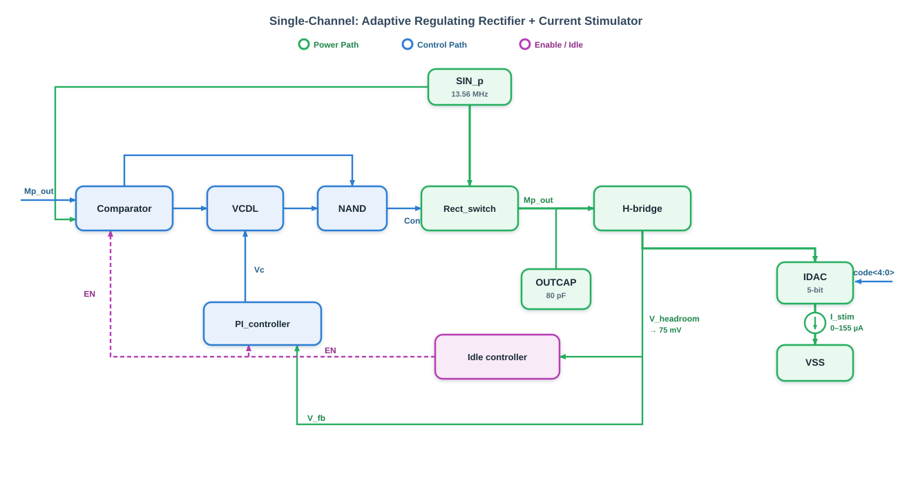
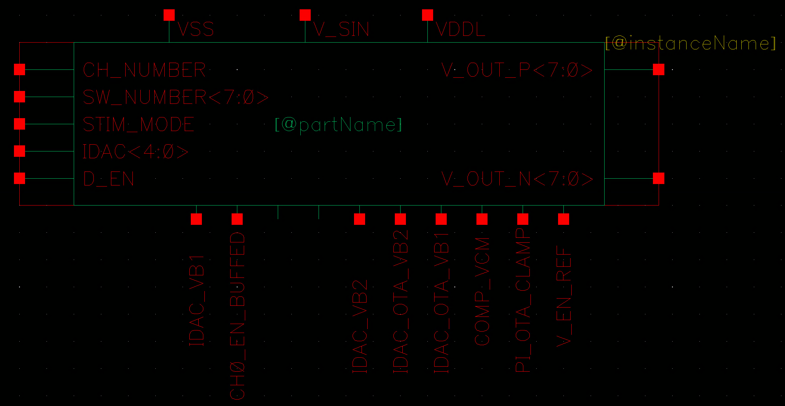
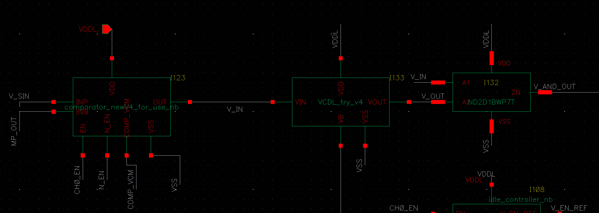
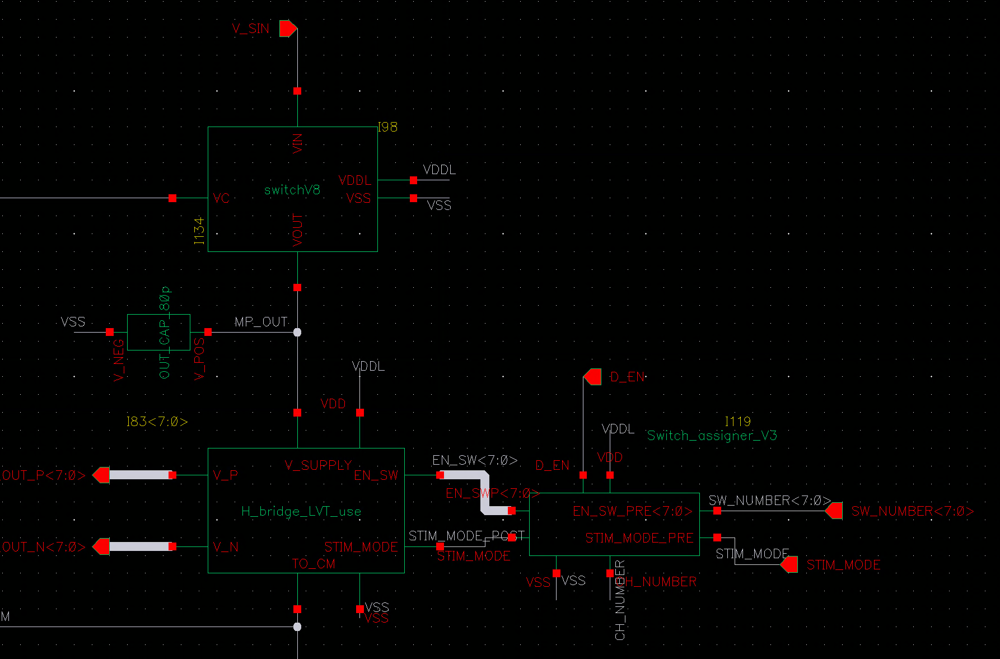
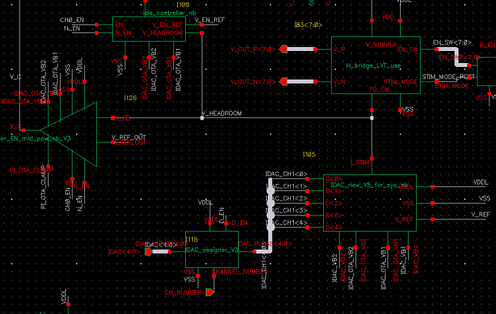
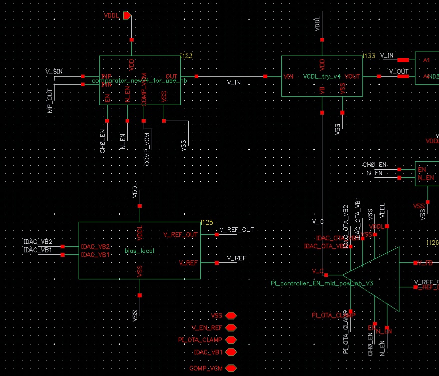
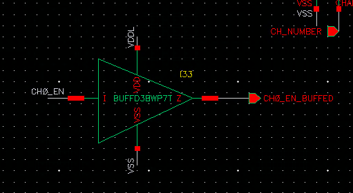

# QC_rectifier_CH0 — 单通道(满血版)

> 单个刺激通道。CH0 = 满血版(8 电极全独立引出 + EN 缓冲)。CH1–7 复用同一核心,仅电极合并。
> 来源:figures/QC_rectifier_CH0_symble.png(符号)、QC_rectifier_CH0.png(总体 schematic,总览级)

---

## 1. 符号端口(QC_rectifier_CH0)

**顶部:** VSS、**V_SIN**、VDDL
> 注意输入脚是通用名 `V_SIN`(非 SIN_P)。所以 CH0–3 接 SIN_P、CH4–7 接 SIN_N,同一 cell 复用。

**左侧(配置输入,来自 data_inputV2):**
| Pin | 位宽 | 说明 |
|-----|------|------|
| CH_NUMBER | 1? | 本通道编号选通 |
| SW_NUMBER<7:0> | 8 | 开关/电极选择 |
| STIM_MODE | 1 | 刺激模式 |
| IDAC<4:0> | 5 | 电流幅度码(5-bit) |
| D_EN | 1 | 数字使能 |

**右侧(输出):**
| Pin | 位宽 | 说明 |
|-----|------|------|
| V_OUT_P<7:0> | 8 | 8 电极 P 侧(CH0 全独立) |
| V_OUT_N<7:0> | 8 | 8 电极 N 侧(CH0 全独立) |

**底部:**
| Pin | 方向 | 说明 |
|-----|------|------|
| IDAC_VB1 | IN | IDAC bias(全局) |
| CH0_EN_BUFFED | **OUT** | Idle EN 缓冲输出(仅 CH0,可观测) |
| IDAC_VB2 | IN | IDAC bias(全局) |
| IDAC_OTA_VB2 | IN | IDAC OTA bias(全局) |
| IDAC_OTA_VB1 | IN | IDAC OTA bias(全局) |
| COMP_VCM | IN | comparator 共模(全局) |
| PI_OTA_CLAMP | IN | PI OTA 钳位(全局) |
| V_EN_REF | IN | Idle 阈值基准(全局) |

> ✅ **已确认:V_REF(45mV,IDAC 钳位)和 V_REF_OUT(75mV,PI 基准)是通道内 `bias_local` 本地生成的**
> ——这就是"一部分 bias 改为通道内 local"的内容(最敏感的两个低压基准本地化,减少长走线噪声)。
> 故 CH0 符号底部不含 V_REF / V_REF_OUT 输入,只有 V_EN_REF 等全局 bias。
>
> **读图约定(重要):白字 = 实际连接的全局 net 名(权威);红字 = 符号内部 pin 名。** 记录端口时以白字为准。

---

## 2. 内部子模块(从总体 schematic 初判,待逐块确认)

总体 schematic(QC_rectifier_CH0.png)分辨率下只能看到大致布局,可辨识的块:

- 左上 / 上排:整流相位控制相关(switchV8 / comparator / VCDL / NAND)
- 中部:一个 OTA 三角形(comparator 或 PI 的运放)
- 中下:多输入大块(H_bridge / IDAC)
- 左中:一个块带多 bus 输出(可能 bias_local 或 assigner)
- **底部:一个 buffer 三角形(BUFFD?)** → 推测是 CH0 专属的 EN 缓冲(产生 CH0_EN_BUFFED)

> 待你发各子模块放大图后逐一确认。预期子模块清单(来自 10_1):
> switchV8、comparator_newV4、VCDL_tryc_v4、NAND、PI_controller、Idle_controller、
> bias_local、IDAC_new_V5、IDAC_assigner_V3、H_bridge_LVT_use、Switch_assigner_V3、Co、(+ CH0 的 EN buffer)

---

## 3. 待确认
- [ ] 底部 buffer 是否就是 CH0 专属 EN 缓冲?CH1–7 是否没有?
- [ ] CH_NUMBER 位宽与作用(选通本通道?)

---

## 4. 子模块清单(03_modules/QC_rectifier_CH0/sub/)

| 子模块 | Cell | 状态 | 路径 |
|--------|------|------|------|
| comparator | comparator_new_4_for_use_nb (I123) | ⏳ symbol 已记 | `sub/comparator/` |
| VCDL | VCDL_try_v4 (I133) | ⏳ symbol 已记 | `sub/VCDL/` |
| NAND | ND2D1BWP7T (I132) | ✅ 标准单元 | `sub/NAND/` |
| switchV8 | switchV8 (I98) | ⏳ symbol 已记 | `sub/switchV8/` |
| Co | OUT_CAP_80p (80pF) | ✅ 无源 | `sub/Co/` |
| H_bridge | H_bridge_LVT_use (×8, I83<7:0>) | ⏳ symbol 已记 | `sub/H_bridge/` |
| Switch_assigner | Switch_assigner_V3 (I119) | ✅ 标准单元 | `sub/Switch_assigner/` |
| PI_controller | PI_controller_EN_mid_pow_nb_V3 (I126) | ⏳ symbol 已记 | `sub/PI_controller/` |
| Idle_controller | idle_controller_nb (I108) | ⏳ symbol 已记 | `sub/Idle_controller/` |
| IDAC | IDAC_new_V5_for_sys_nb (I105) | ⏳ symbol 已记 | `sub/IDAC/` |
| IDAC_assigner | IDAC_assigner_V3 (I118) | ✅ 标准单元 | `sub/IDAC_assigner/` |
| bias_local | bias_local (I128) | ⏳ symbol 已记 | `sub/bias_local/` |
| EN buffer(**CH0 专属**) | BUFFD3BWP7T (I33) | ✅ 标准单元 | `sub/EN_buffer/` |

## 5. 截图索引
| 文件 | 内容 |
|------|------|
| `./QC_rectifier_CH0_symble.png` | 符号(端口) |
| `./QC_rectifier_CH0.png` | 总体 schematic(总览) |
| `./QC_rectifier_CH0_compVCDLNAND.png` | 相位控制链:comparator→VCDL→NAND |
| `./QC_rectifier_CH0_SWCAPHbridgeSWassign.png` | 能量/刺激路径:switchV8→Co→H_bridge×8→Switch_assigner |
| `./QC_rectifier_CH0_PIidleIDAC.png` | 反馈环:PI + Idle + IDAC + IDAC_assigner |
| `./QC_rectifier_CH0_biasloop.png` | bias_local + PI 闭环 + 控制链概览(V_C 绕回) |
| `./QC_rectifier_CH0_ENbuffer.png` | CH0 专属 EN 观测 buffer |

## 6. 状态
✅ 符号确认;13/13 子模块 symbol/接口已记;三条信号路径连通。🔲 各模块内部晶体管级(MOS 尺寸)待补。

---

## 7. 工作原理(对外讲解版)

> 与 `../../10_integration/10_2_single_channel.md` 同源,此处图文并茂、适合对着电路图讲。已经用户逐条核对确认。

### 7.0 一句话

每个通道 = **自适应调压整流器 + 精密电流刺激器**。
用相位控制整流开关的**导通时长**,把输出电容 Co 充到"**刚刚好**"的电压,使电流源(IDAC)的余量电压(headroom)精确锁在 **75 mV**,从而把功率浪费(= headroom × 电流)压到最低。

### 7.1 核心问题(为什么这么设计)

神经刺激要给电极送**精确电流**,电流源(IDAC)要工作必须有最小"余量电压"(headroom)。
- 传统做法:固定高压供电 → 多余电压 `供电 − 电极 − headroom` 全浪费在 IDAC 上变成热。
- 无线供电功率宝贵(13.56 MHz,SAR 上限 544 µW/mm²)→ 浪费不可接受。

**方案:** 整流器每周期只把 Co 充到刚好够 75 mV headroom,一点不多。
**被控变量:** `V_headroom`(I_STIM 节点电压),目标 **75 mV**。太高浪费、太低 IDAC 掉饱和。

### 7.2 信号流程图(总览,横平竖直版)

> 🟢 Power Path ┆ 🔵 Control Path ┆ 🟣 Enable/Idle。手绘 SVG,VS Code 直接预览(无需插件),可直接粘进答辩 PPT(矢量可编辑)。
> 与 `../../10_integration/10_2_single_channel.md` 第 0 节同源。



### 7.3 三条信号路径(配电路截图)

**符号总览:**



#### 路径 ①:相位控制(整流开关的导通时序怎么来)



- **comparator** 比较 `V_SIN` vs `MP_OUT`:SIN_p > MP_OUT → V_IN=1(此刻有能量可往 Co 灌);SIN_p < MP_OUT → 强制关断(防 Co 倒灌回源)。
- V_IN 分两路:直连 **NAND** 的 A1;经 **VCDL** 延迟 td 并反相到 A2。
- NAND 在 V_IN 上升后的 td 窗口内输出低 → **宽度 = td 的低有效 control pulse** → 驱动 switchV8。
- **td 越长 → 开关导通越久 → 每周期充电越多 → headroom 越高。**

#### 路径 ②:能量 / 刺激(电流怎么流)



- control pulse 让 **switchV8** 导通 → SIN_p 给 **Co(80 pF)** 充电 → 抬升 **MP_OUT**。
  - 高压时 PMOS 导通;**低压时自动切互补 NMOS 支路 → 低压效率 ↑~150%**。
- MP_OUT = **8 个 H 桥的共享电源**,`EN_SW<7:0>` one-hot **每次只导通 1 个**(通道内 8 电极 TDM)。
- 选中的 H 桥 → 电极 P → 组织负载 → 电极 N → **I_STIM(= V_headroom)** → IDAC 把设定电流拉到 VSS。
- **Switch_assigner_V3** 定"哪个电极 + 正/反极性(双相)"。

#### 路径 ③:反馈(怎么把 headroom 锁住)



`V_headroom` 同时送三处:
- **PI 控制器**:比较 V_headroom vs `V_REF_OUT`(75 mV)→ 输出控制电压 `V_C` → 调 VCDL 的 td(闭环)。积分项消除基线开环 OTA 的稳态误差。
- **Idle 控制器**:比较 V_headroom vs `V_EN_REF`(200 mV)→ 若过高(轻/空载)则关掉 PI + comparator,只留 IDAC(省电)。
- **IDAC**:headroom 就是它工作的余量;内部 OTA 把电流镜钳位管 drain 钳在 `V_REF` = 45 mV。

**本地基准 + 闭环闭合:**



- **bias_local** 在通道内本地生成 `V_REF_OUT`(75 mV)、`V_REF`(45 mV)——最敏感的两个低压基准,本地化避免长走线噪声。
- **V_C** 从 PI 输出绕回 VCDL 的 **VB** 脚 → 闭环成立。

### 7.4 一个 13.56 MHz 周期内发生什么(73.8 ns)

1. **触发** — SIN_p 升过 MP_OUT,comparator 输出 V_IN=1。
2. **生成脉冲** — VCDL + NAND 产生宽度 td 的低脉冲。
3. **整流充电** — switchV8 导通 td,SIN_p 给 Co 充电(高压 PMOS / 低压互补 NMOS)。
4. **电流刺激** — Co 经选中 H 桥驱动电极,电流回 I_STIM,IDAC 精确下拉(内部钳 45 mV)。
5. **PI 调节** — PI 每周期采样一次,用积分项把 V_headroom 锁在 75 mV。
6. **空载省电** — headroom > 200 mV → Idle 关 PI + comparator,只剩 IDAC。

### 7.5 闭环动态

```
V_headroom → PI → V_C → VCDL(td) → NAND(pulse) → switchV8(导通时长) → Co → MP_OUT
      ↑                                                                        │
      └────────────────────────────────────────────────────────────────────┘
```
- 负反馈:headroom 偏高 → **V_C↑ → VCDL 饥饿电流↑ → td↓ → pulse 变窄 → 充电少 → headroom 降回 75 mV**。
- **约束:这是采样系统**(每 RF 周期采一次,PI 输出被 13.56 MHz 采样),环路带宽必须 < f_sw/2 = **6.78 MHz**;补偿电容缩小 ~6 倍即失稳。这也是 PI 响应速度受限的根源。

### 7.6 三个电压点辨析(对外口径,别混)

| 量 | 值 | 角色 |
|----|----|------|
| 基线 headroom | 250 mV | 对比基准 |
| **V_REF**(IDAC 钳位) | **45 mV** | 改进 headline → **↓82%**(CV/答辩引用) |
| **headroom**(工作点) | **75 mV** | PI 实际锁定值(45mV + 余量) |

### 7.7 CH0 满血特色(残血版 CH1–7 没有)



- **8 电极对全部独立引出**(V_OUT_P/N<7:0>);CH1–7 则 4-by-4 合并到 pad。
- **CH0_EN** 经 `BUFFD3BWP7T` 缓冲 → `CH0_EN_BUFFED` 引出,片外可实时观测该通道何时进入 idle。
- 二者构成 CH0 的完整**可观测性**(debug/measurement 专用通道)。
