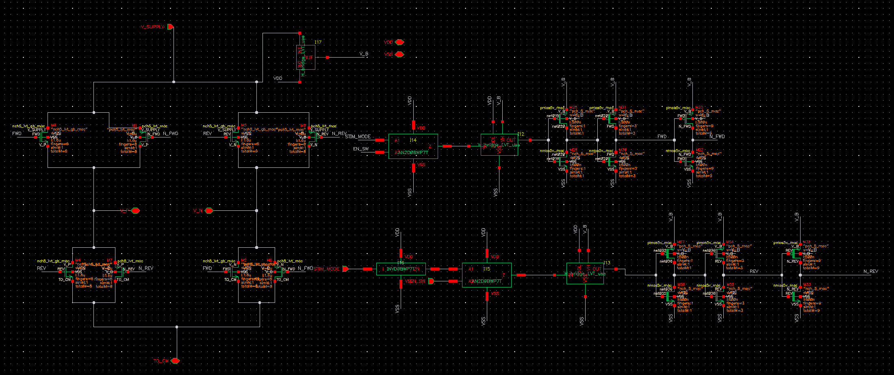
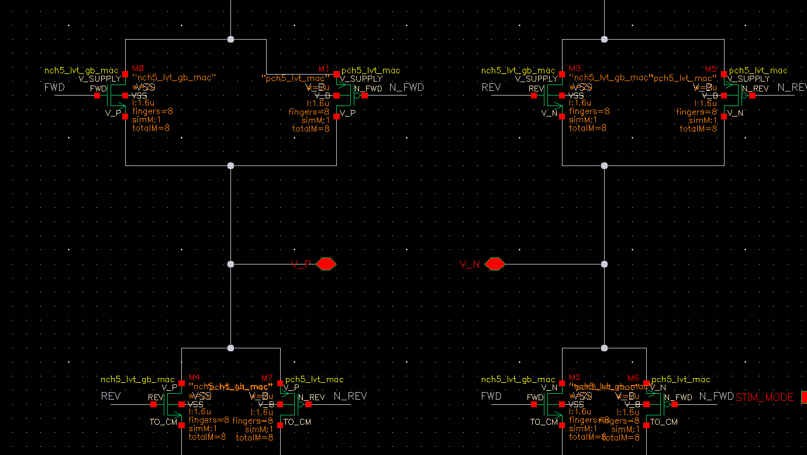

# H_bridge_LVT_use — 8 路 H 桥电极驱动阵列

> Cell: `H_bridge_LVT_use`(×8 阵列,bus I83<7:0>)
> 父模块:QC_rectifier_CH0。能量路径输出级(电流送电极)。
> 来源:../../QC_rectifier_CH0_SWCAPHbridgeSWassign.png(symbol 级,MOS 尺寸待内部 schematic)

---

## 1. 功能

8 个 H 桥的阵列,共享 MP_OUT 作电源(V_SUPPLY)。**每次只有一个导通**(EN_SW<7:0> one-hot),
即通道内 1:8 电极时分复用(TDM)。被选中的 H 桥把 Co 电压驱动到对应电极对,
电流经组织负载流回 TO_CM(= V_headroom = I_STIM 节点)。

- **STIM_MODE 定极性(双相):**
  - =1 Forward:电流 V_P → 电极 → V_N → I_STIM
  - =0 Reverse:电流 V_N → 电极 → V_P → I_STIM
- LVT(低阈值)器件,降低开关压降。

## 2. 接口

| Pin | 方向 | 连接 | 说明 |
|-----|------|------|------|
| V_SUPPLY | IN(电源) | **MP_OUT** | Co 储能轨(8 桥共享) |
| EN_SW<7:0> | IN | Switch_assigner EN_SW_PRE<7:0> | one-hot 选 1/8 电极 |
| STIM_MODE | IN | Switch_assigner STIM_MODE_PRE(POST) | 正/反极性 |
| V_P<7:0> | OUT | **OUT_P<7:0>** | 电极 P 侧(CH0 全独立引出) |
| V_N<7:0> | OUT | **OUT_N<7:0>** | 电极 N 侧 |
| TO_CM | OUT | **V_headroom**(I_STIM) | 电流汇集回流节点 |
| VDD/VDDL/VSS | PWR | | |

## 3. V_headroom 节点(TO_CM)= 反馈核心

H_bridge 底部 TO_CM 节点电压 = **V_headroom**(电流源的"余量"电压),同时是三处输入:
1. **IDAC** 的输入电压(IDAC 在此 sink 设定电流)
2. **PI 控制器**的输入(另一输入为参考 V_REF_OUT=75mV)→ 调 VCDL → 稳 headroom
3. **Idle_controller_nb** 的输入(与 V_EN_REF=200mV 比较,判空载)

稳态目标 V_headroom = 75 mV。

## 4. 关键点
- 8 桥共享 MP_OUT 电源 + 单次单导通 = 单通道驱动 8 电极的关键
- CH0 把 8 对 V_P/V_N 全独立引出(可观测);CH1–7 4-by-4 合并到 pad

## 5. 内部结构





**总体分左右两块:**
- **左:H 桥 4 管**(功率级,LVT 5V NMOS)
- **右:控制信号 + fan-out**(Level Shifter + 逻辑解码 + buffer 链)

### 5.1 H 桥功率管(4× nch5v\_lv\_mac)

```
V_SUPPLY ──┬──[Q1, FWD gate]──── V_P ────[Q2, REV gate]──┐
           │                                               │
           └──[Q3, REV gate]──── V_N ────[Q4, FWD gate]──┘
                                                           │
                                                       TO_CM (V_headroom)
```

| 管 | 类型 | 功能 | gate 信号 | 导通方向 |
|----|------|------|-----------|---------|
| Q1(高侧左) | PMOS LVT 5V | V\_SUPPLY → V\_P | FWD | Forward 时 ON |
| Q4(低侧右) | NMOS LVT 5V | V\_N → TO\_CM | FWD | Forward 时 ON |
| Q2(高侧右) | PMOS LVT 5V | V\_SUPPLY → V\_N | REV | Reverse 时 ON |
| Q3(低侧左) | NMOS LVT 5V | V\_P → TO\_CM | REV | Reverse 时 ON |

**MOS 尺寸(PMOS 与 NMOS 相同):**

| 参数 | 值 |
|------|----|
| W | 2 µm |
| L | 1.6 µm |
| fingers | 8 |
| totalM | 8 |
| 有效宽度 | 2µm × 8 = **16µm** |

> L=1.6µm 远大于 5V 最小 L(~500nm):长沟道提供更低漏电 + 更高输出阻抗,确保 OFF 状态的 8 个未选通桥不对 V\_headroom 产生干扰。PMOS/NMOS 同尺寸,对称 sizing 使双相刺激正向/反向电荷量精确相等。

### 5.2 控制逻辑解码

FWD / REV 信号由 EN\_SW 和 STIM\_MODE 解码:
- **FWD = EN\_SW AND STIM\_MODE** → 选中且正向 → Q1/Q4 ON
- **REV = EN\_SW AND NOT(STIM\_MODE)** → 选中且反向 → Q2/Q3 ON

Level Shifter 将 1.8V 逻辑信号提升至 5V 域,再经 buffer 链 fan-out 至各管 gate。

---

## 6. 工作原理(对外讲解版)

**一句话:** 被 Switch\_assigner 选中的 H 桥根据 STIM\_MODE 导通对角线两管,把 Co 电压单向驱动到电极对,产生双相电流脉冲用于神经刺激。

---

**① 时分复用(TDM)选通**

8 个 H 桥共享同一 V\_SUPPLY(MP\_OUT)。Switch\_assigner 输出 one-hot EN\_SW\<7:0\>:某一周期只有 1 个桥的 EN\_SW=1,其余 7 个全 OFF。被选中的桥在该周期完成一次刺激脉冲,下一周期轮到下一个电极。13.56MHz 载波 / 8 个通道 = 每个电极约 1.7MHz 等效更新率。

---

**② 双相刺激极性控制(STIM\_MODE)**

每次选通时:

| STIM\_MODE | 导通管 | 电流方向 | 作用 |
|-----------|--------|---------|------|
| 1(Forward) | Q1 + Q4 | V\_SUPPLY → V\_P → 组织 → V\_N → TO\_CM | 正相刺激 |
| 0(Reverse) | Q2 + Q3 | V\_SUPPLY → V\_N → 组织 → V\_P → TO\_CM | 反相电荷平衡 |

双相波形(正相+反相)是神经刺激安全标准的基本要求:消除直流分量,避免电荷积累导致电极腐蚀或组织损伤。

---

**③ LVT 器件的必要性**

V\_headroom = 75mV,V\_SUPPLY 也只有数百 mV 量级。标准 Vth 器件(Vth ≈ 0.4–0.5V)在如此低的供电下导通电阻大、压降超过 V\_headroom 本身 → 无法建立有效电流回路。LVT 器件 Vth ≈ 0.2–0.3V,在低 V\_supply 下仍能充分导通。

---

**④ 与上下游的连接**

```
V_SUPPLY (= MP_OUT, Co 储能) → H 桥高侧 → 电极 → 组织 → H 桥低侧 → TO_CM
                                                                        ↓
                                                                   IDAC sink I_stim
                                                                   PI 检测 V_headroom
                                                                   Idle 检测空载
```

TO\_CM 节点是整个反馈环的汇集点:H 桥出来的电流在这里被 IDAC 精确吸收,节点电压 = V\_headroom = PI 的被控量。

## 7. 状态
✅ symbol/接口已记。
✅ 内部结构已记(H 桥 4 管 LVT 5V PMOS 高侧 + NMOS 低侧 + 控制逻辑)。
✅ MOS 尺寸确认:PMOS/NMOS 均 W=2µm / L=1.6µm / fingers=8 / totalM=8,有效宽度 16µm。
✅ 工作原理文档化。
