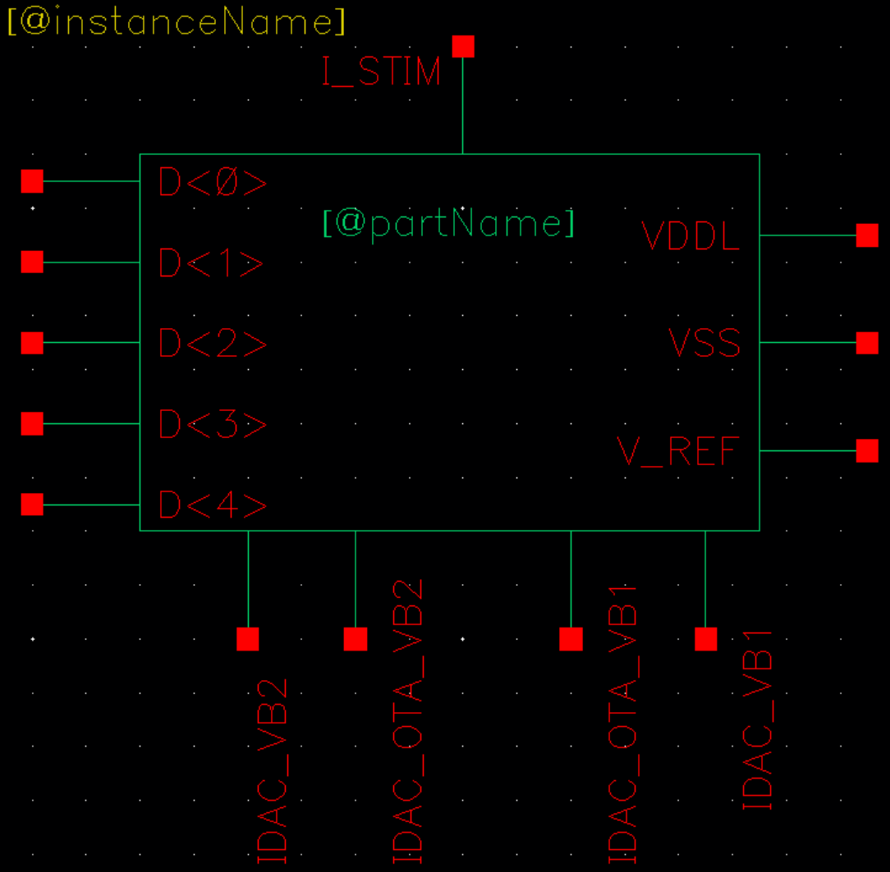
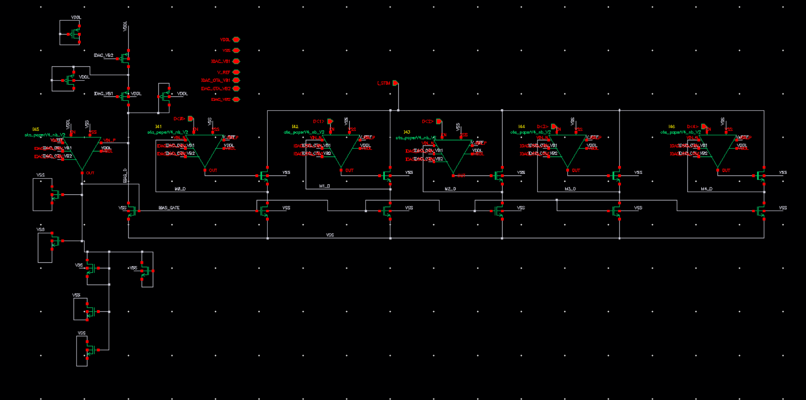
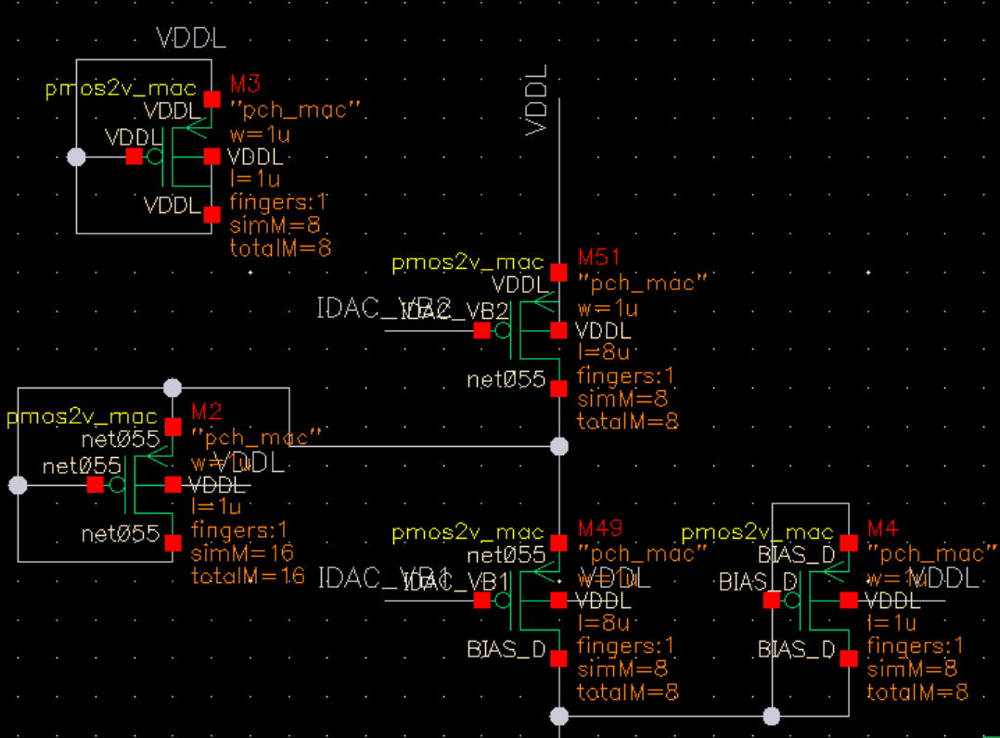
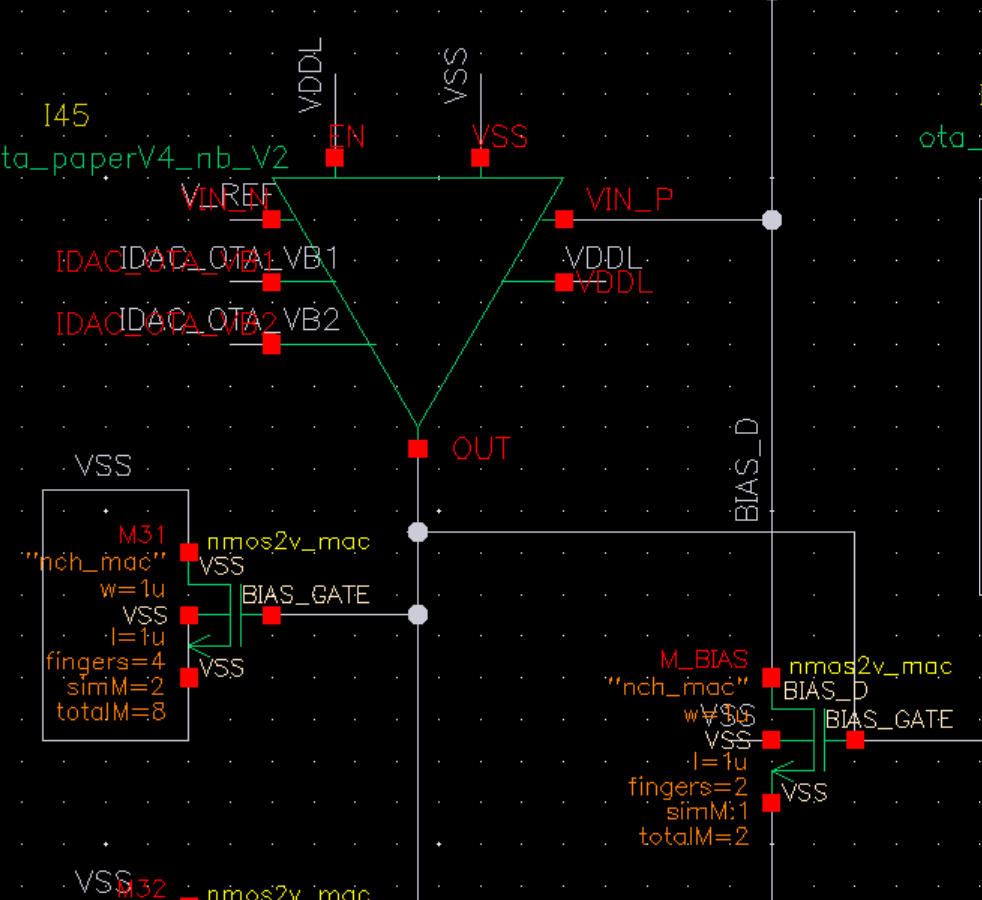
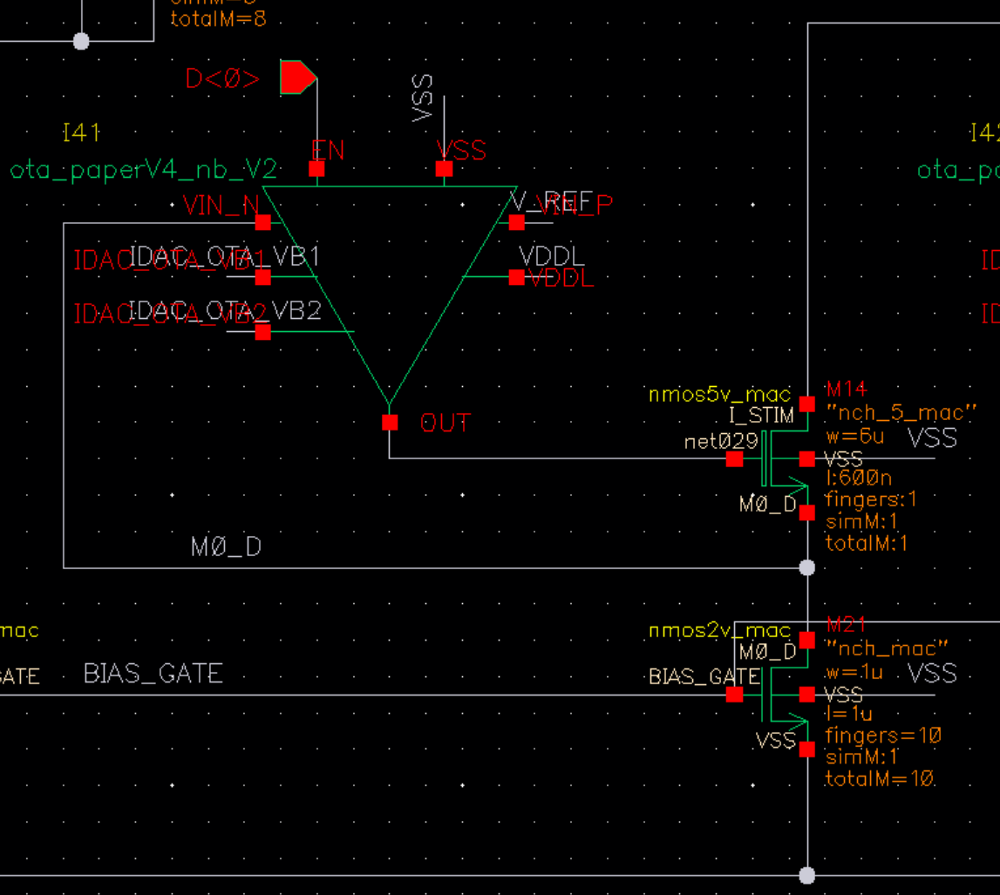

# IDAC_new_V5_for_sys_nb — 精密电流 DAC(电流 sink)

> Cell: `IDAC_new_V5_for_sys_nb`(实例 I105)
> 父模块:QC_rectifier_CH0。决定流过负载/电极的刺激电流大小。
> 来源:../../QC_rectifier_CH0_PIidleIDAC.png(symbol 级,MOS 尺寸待内部 schematic)

---

## 1. 功能

5-bit 电流 DAC,作为 current sink 从 **I_STIM(= V_headroom)** 节点把设定电流拉到 VSS,
即决定流过组织负载的刺激电流大小(0–155 µA,5 µA 步进,31 步)。

**核心设计(本工作贡献):**
- **输入电压可做到极低**:内部 OTA 把电流镜钳位管 drain 钳在 **V_REF = 45 mV**(vs Cesc ~250mV,↓82%)
- **输出电阻足够高**:保证电流源特性(负载/电压变化时电流稳定)
- 二者兼顾 → 在极低 headroom 下仍是良好电流源,这是整机效率提升的主因

电流码由 `IDAC_assigner_V3` 经 D<4:0> 给入。

## 2. 接口

| Pin | 方向 | 连接 | 说明 |
|-----|------|------|------|
| I_STIM | IN(顶) | **V_HEADROOM** 节点 | 电流从此 sink 到 VSS;= headroom 节点 |
| D<4:0> | IN | IDAC_CH1<4:0>(IDAC_assigner OUT) | 5-bit 电流码 |
| V_REF | IN | 45 mV(bias_local) | 电流镜钳位基准(内部 OTA 目标) |
| IDAC_VB1, IDAC_VB2 | IN | 全局 bias | 电流镜偏置 |
| IDAC_OTA_VB1, IDAC_OTA_VB2 | IN | 全局 bias | 内部钳位 OTA 偏置 |
| VDDL / VSS | PWR | | |

## 3. 关键点
- I_STIM 节点电压 = V_headroom,是整个反馈环的被控量(PI 维持在 75mV)
- 低 headroom(45mV)+ 高输出阻抗是核心卖点;实现方式见内部 schematic
- 空载时(Idle 关闭 PI/comparator)IDAC 仍工作,维持电流

## 4. 内部结构

整体分三块:**IDAC_bias(基准尾电流)** + **local mirror(本地电流镜 + OTA 钳位)** + **5× bit cell(二进制加权电流沉)**

### 4.1 IDAC_bias(左上角,产生 1µA 尾电流)

> 两管串联(PMOS + NMOS cascode),gate 接全局 bias;其余为 dummy 管。

| 管 | 类型 | W | L | fingers | gate 信号 | 作用 |
|----|------|---|---|---------|-----------|------|
| M51 | PMOS | 1 µm | 8 µm | 8 | IDAC_VB2 | 产生 1µA 参考尾电流 |
| M49 | NMOS | 1 µm | 8 µm | 8 | IDAC_VB1 | cascode 定电流 |
| (其余) | — | — | — | — | — | dummy(匹配用) |

输出:**1µA 尾电流** → 喂下方 local mirror。

### 4.2 IDAC_CM — 基准镜 + OTA 钳位(左侧主体)

**核心思路(非常规):** 不用二极管接法产生 BIAS_GATE,而是用 OTA 闭环把 M_BIAS drain **主动钳在 45mV**。
- I45(`ota_paperV4_nb_V2`):V⁻ = V_REF(45mV),V⁺ = M_BIAS drain,OUT → M_BIAS gate(= BIAS_GATE)
- OTA 反馈强制 M_BIAS drain = 45mV,流过电流 = 1µA(由 IDAC_bias 尾电流决定)
- BIAS_GATE 横向分发至全部 5 个 bit cell → 每个 bit cell mirror 管的 drain 也被锁在 ≈45mV

**M_BIAS:**

| 管 | 类型 | W | L | fingers | totalM | gate | drain |
|----|------|---|---|---------|--------|------|-------|
| M_BIAS | NMOS (nch_mac) | 1 µm | 1 µm | 2 | 2 | BIAS_GATE(OTA OUT) | VIN_P → 45mV(OTA 钳位) |

其余(M31 等):dummy,暂不记录。

### 4.3 Bit cell × 5(M0_D ~ M4_D,二进制加权)

**每个 bit cell 结构(以 bit0 为例,I41 + M21 + M14):**

```
I_STIM (= V_headroom)
    │
   M14  ← gate = I41 OTA OUT  [5V NMOS,隔压 + 调节]
    │   net029 (= 45mV,OTA 钳位点)
   M21  ← gate = BIAS_GATE    [2V NMOS,实际电流镜]
    │
   VSS
```

**I41(ota_paperV4_nb_V2)闭环:**
- V⁺ = V_REF (45mV)
- V⁻ = net029 (M21 drain)
- OUT → M14 gate
- 反馈强制 M21 drain = 45mV;D<0>=0 时 OTA 关断(EN 脚)

**M14 双重作用:**
1. **电压隔离**:5V 器件承受 I_STIM 高压,保护下方 2V 的 M21
2. **输出阻抗增强**:类 cascode 结构,大幅提高整体输出阻抗
3. **drain 钳位执行器**:OTA 通过 M14 gate 把 M21 drain 锁在 45mV

**尾电流管(2V NMOS nch_mac,W=1µm L=1µm,二进制加权):**

| bit | OTA 实例 | 尾电流管 | fingers | totalM | 电流镜倍率 | I_bit |
|-----|----------|----------|---------|--------|-----------|-------|
| 0 | I41 | M21 | 10 | 10 | ×5  | **5 µA**  |
| 1 | I42 | M23 | 20 | 20 | ×10 | **10 µA** |
| 2 | I43 | M24 | 40 | 40 | ×20 | **20 µA** |
| 3 | I44 | M25 | 80 | 80 | ×40 | **40 µA** |
| 4 | I46 | M26 | 160 | 160 | ×80 | **80 µA** |

**调控管(5V NMOS nch_5_mac,W=6µm L=600nm):**

| bit | 调控管 | fingers | totalM |
|-----|--------|---------|--------|
| 0 | M14 | 1 | 1 |
| 1 | M22 | 1 | 1 |
| 2 | M28 | 2 | 2 |
| 3 | M30 | 2 | 2 |
| 4 | M39 | 4 | 4 |

**总电流范围:** 0 ~ 155 µA(5+10+20+40+80),LSB = 5 µA,31 步。

> **亚阈值工作能力:** M21 工作在极低 drain 电压(45mV)下依然精确,关键在于 M14+OTA 消除了 drain 电压变化对 M21 电流的影响(高输出阻抗),即使 M21 进入亚阈值区也能稳定输出。

### 4.4 内部 OTA — ota_paperV4_nb_V2

IDAC\_CM(I45)和全部 5 个 bit cell(I41–I46)共使用同一 OTA cell,共 6 个实例。
功能:将目标 NMOS 的 drain 钳位在 V\_REF = 45mV。

> 详情见子模块文档:[sub/ota\_paperV4\_nb\_V2/ota\_paperV4\_nb\_V2.md](sub/ota_paperV4_nb_V2/ota_paperV4_nb_V2.md)

---

## 5. 工作原理(对外讲解版)





整个 IDAC 分三层:**参考尾电流生成 → BIAS_GATE 产生 → 5× bit cell 二进制叠加**。

---

### 5.1 第一层:产生 1µA 参考尾电流(IDAC_bias)



M51(PMOS,1µm/8µm,8f)和 M49(NMOS,1µm/8µm,8f)串联,gate 分别接全局偏置 IDAC_VB2 / IDAC_VB1,构成 cascode 电流源。输出稳定的 **1µA 尾电流**,喂给下方的 IDAC_CM 作为整个 DAC 的电流基准。其余管为 dummy,用于匹配。

---

### 5.2 第二层:生成 BIAS_GATE(IDAC_CM)



M_BIAS(2V NMOS,1µm/1µm,2f)是参考电流镜管。I45(`ota_paperV4_nb_V2`)构成一个负反馈回路:

- **V⁺(VIN_P)** = M_BIAS drain
- **V⁻(VIN_N)** = V_REF(45mV,来自 bias_local)
- **OUT** → M_BIAS gate(= BIAS_GATE)

OTA 反馈把 M_BIAS drain **主动钳在 45mV**,流过的电流等于 1µA 尾电流。OTA 的输出 **BIAS_GATE** 横向分发给全部 5 个 bit cell,作为所有电流镜管共享的 gate 电压。

> 与传统二极管接法的区别:二极管接法 gate 电压随工艺/温度浮动;OTA 闭环主动调节,强制 drain 电压精确等于 V_REF,消除 Vds 不确定性。

---

### 5.3 第三层:5× bit cell 二进制叠加



每个 bit cell 结构相同(以 bit0 为例),电流路径为:

```
I_STIM (= V_headroom)
    │
   M14  ← gate = I41 OTA OUT  [5V NMOS,6µm/600nm]
    │   net029 — 钳位在 45mV
   M21  ← gate = BIAS_GATE    [2V NMOS,1µm/1µm,10f]
    │
   VSS
```

**I41(OTA)闭环:**
- V⁺ = V_REF(45mV),V⁻ = M21 drain(net029),OUT → M14 gate
- 反馈把 M21 drain 精确锁在 45mV

**M14 的双重作用:**
1. **电压隔离**:5V 器件承受 I_STIM 高压(最高可超过 1.8V),保护下方 2V 的 M21
2. **Regulated cascode**:OTA 通过 M14 gate 把 M21 drain 钳在 45mV;M14 吸收掉多余压降,同时大幅提高整体输出阻抗

**D<x> 使能:**D<x>=1 → OTA 开启,bit cell 接入电流路径;D<x>=0 → OTA 关断,M14 截止,该 bit 贡献电流为零。

---

### 5.4 为什么能把 headroom 从 250mV 压到 45mV

传统电流镜:镜像管必须 Vds > Vds\_sat(≈250mV)才能保持饱和,输出准确电流。负载电压低于此阈值时电流精度迅速劣化。

**本设计的关键:**每个 bit cell 的 OTA 独立把自己的 M21 drain 钳在 45mV——所有 bit 的 Vgs 相同(共享 BIAS_GATE)、Vds 相同(均为 45mV),电流比值完全由 W/L(finger 数)决定,与 I_STIM 节点电压无关。M14 承担多余压降,因此 **I_STIM 只需维持 45mV** 即可保证所有 bit cell 输出精确电流。

这使得 PI 控制器只需把 V_headroom 维持在 75mV(45mV + 工作余量),比传统基线的 250mV 降低 **↓82%**,是整机功效提升的主因。

---

## 6. 状态
✅ IDAC_bias、IDAC_CM、5× bit cell MOS 尺寸全记。
✅ ota_paperV4_nb_V2 已拆分为独立子模块文档:sub/ota_paperV4_nb_V2/ota_paperV4_nb_V2.md
⏳ `figures/OTA_IDAC_right.png` 待保存(右侧 NMOS cascode + PMOS 负载截图)。
⏳ `figures/OTA_IDAC_bias.png` 待保存(VB1/VB2 bias 生成截图)。
