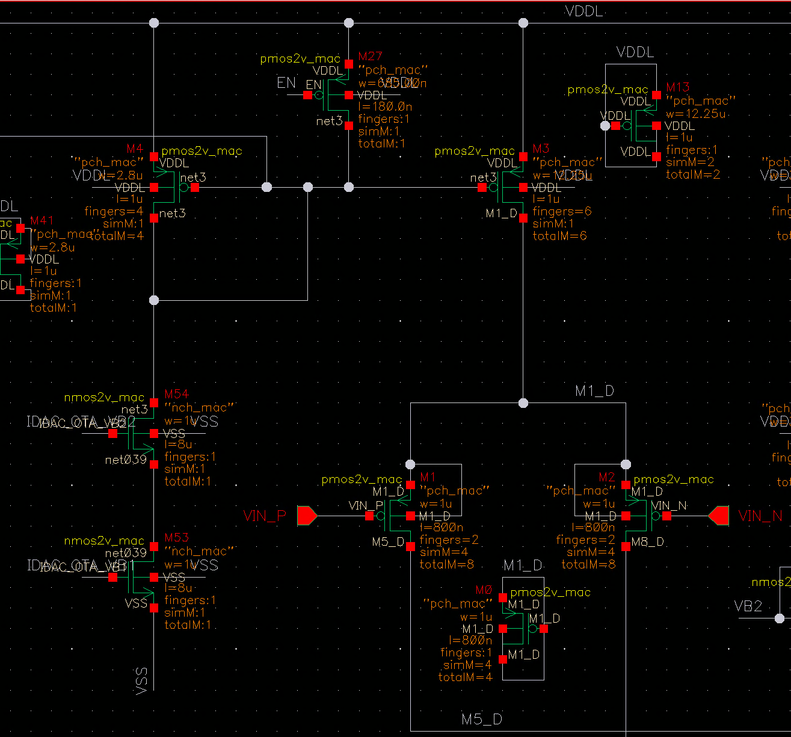
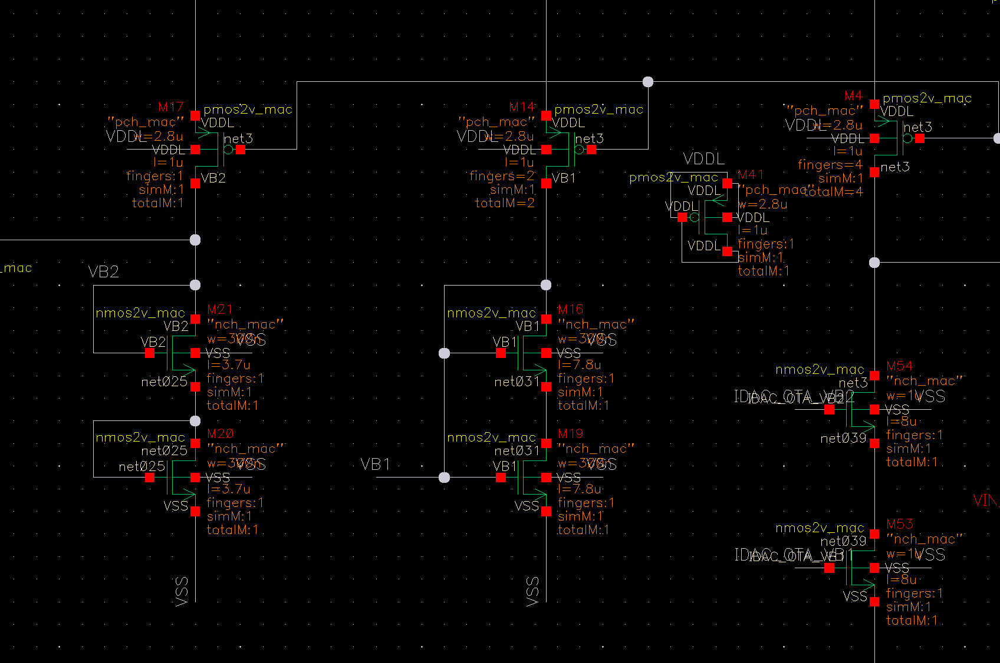

# ota_paperV4_nb_V2 — 精密钳位运放

> Cell: `ota_paperV4_nb_V2`
> 父模块:IDAC\_new\_V5\_for\_sys\_nb。
> 在 IDAC 内部共使用 **6 个实例**:I45(IDAC\_CM 钳位)+ I41/I42/I43/I44/I46(bit0–4 各一个)。

---

## 1. 功能

单端输出 OTA,用于 **regulated cascode** 反馈回路:将目标 NMOS(M\_BIAS 或 M21 等)的 drain 精确钳位在 **V\_REF = 45mV**,使电流镜在极低 headroom 下仍能输出精确电流。

**两种连接方式(同一 cell,极性不同):**

| 实例 | V⁺(VIN\_P) | V⁻(VIN\_N) | OUT 去向 | 效果 |
|------|-----------|-----------|---------|------|
| I45(IDAC\_CM) | M\_BIAS drain | V\_REF(45mV) | BIAS\_GATE | 钳位 M\_BIAS drain = 45mV |
| I41–I46(bit cell) | V\_REF(45mV) | M2x drain | M14 gate | 钳位 M2x drain = 45mV |

---

## 2. 接口

| Pin | 方向 | 说明 |
|-----|------|------|
| VIN\_P | IN | 正向输入 |
| VIN\_N | IN | 负向输入 |
| OUT | OUT | 单端输出 |
| EN | IN | 使能(高有效);EN=0 → OTA 完全关断 |
| IDAC\_OTA\_VB2 | IN | 全局 bias → 内部 M54 gate,设定参考电流 |
| IDAC\_OTA\_VB1 | IN | 全局 bias → 内部 M53 gate,设定参考电流 |
| VDDL / VSS | PWR | 1.8V / 地 |

---

## 3. 内部结构(全部 MOS 尺寸)

### 3.1 参考电流生成 + PMOS 镜

> 建立参考节点 net3,所有 PMOS 电流镜的共享基准。

| 管 | 类型 | W | L | fingers | gate | 作用 |
|----|------|---|---|---------|------|------|
| M54 | NMOS (nmos2v\_mac) | 1 µm | 8 µm | 1 | IDAC\_OTA\_VB2 | 参考 NMOS 堆叠上管 |
| M53 | NMOS (nmos2v\_mac) | 1 µm | 8 µm | 1 | IDAC\_OTA\_VB1 | 参考 NMOS 堆叠下管 |
| M4  | PMOS (pmos2v\_mac) | 2.8 µm | 1 µm | 4 | gate=drain=net3 | 参考 PMOS(二极管接),建立 net3 |
| M41 | PMOS (pmos2v\_mac) | 2.8 µm | 1 µm | 1 | net3 | 镜像输出(用途待确认) |
| M3  | PMOS (pmos2v\_mac) | 12.25 µm | 1 µm | 6 | net3 | 镜像 → 输入对 M1/M2 尾电流 |

### 3.2 差分输入对 + 尾电流 + EN

| 管 | 类型 | W | L | fingers | gate | 作用 |
|----|------|---|---|---------|------|------|
| M1, M2 | PMOS (pch\_mac) | 1 µm | 800 nm | 8 | VIN\_P / VIN\_N | 差分输入对(PMOS 适配低共模 V\_REF=45mV) |
| M27 | NMOS (nch\_mac) | 685 nm | 180 nm | 1 | EN | 串在尾电流路径;EN=0 → 截断全部支路 |

### 3.3 折叠输出端 — NMOS cascode

| 管 | 类型 | W | L | fingers | gate | 作用 |
|----|------|---|---|---------|------|------|
| M23, M24 | NMOS (nch\_mac) | 220 nm | 180 nm | 1 | EN 控制(本地) | 折叠路径使能开关 |
| M5 | NMOS (nmos2v\_mac) | 230 nm | 1 µm | 1 | VB1(本地生成) | 折叠电流限制,接收 M1 支路 |
| M6 | NMOS (nmos2v\_mac) | 230 nm | 1 µm | 1 | VB1(本地生成) | 折叠电流限制,接收 M2 支路 |
| M7 | NMOS (nmos2v\_mac) | 220 nm | 1 µm | 1 | VB2(本地生成) | NMOS cascode(左支路) |
| M8 | NMOS (nmos2v\_mac) | 220 nm | 1 µm | 1 | VB2(本地生成) | NMOS cascode(右支路);drain = **单端输出 OUT** |

### 3.4 折叠输出端 — PMOS 自偏置 cascode 负载

| 管 | 类型 | W | L | fingers | 连接 | 作用 |
|----|------|---|---|---------|------|------|
| M11 | PMOS (pmos2v\_mac) | 340 nm | 800 nm | 2 | gate=drain=M9\_S; src=VDDL | 顶层二极管接法,产生 cascode bias M9\_S |
| M12 | PMOS (pmos2v\_mac) | 340 nm | 800 nm | 2 | gate=M9\_S; drain=M10\_S; src=VDDL | 顶层 cascode 输出管 |
| M9  | PMOS (pmos2v\_mac) | 340 nm | 800 nm | 2 | gate=drain=M7\_D | 下层二极管接法,产生镜像 bias M7\_D |
| M10 | PMOS (pmos2v\_mac) | 340 nm | 800 nm | 2 | gate=M7\_D; drain=**OUT** | 下层镜像输出管;drain = 单端输出 OUT |

### 3.5 本地 VB1 / VB2 生成

**VB2 生成(→ M7/M8 gate):**

| 管 | 类型 | W | L | fingers | 连接 | 作用 |
|----|------|---|---|---------|------|------|
| M17 | PMOS (pmos2v\_mac) | 2.8 µm | 1 µm | 1 | gate=net3; drain=VB2 | 参考镜输出,向 VB2 注入电流 |
| M21 | NMOS (nmos2v\_mac) | 320 nm | 3.7 µm | 1 | gate=drain=VB2 | 二极管 NMOS 负载(上) |
| M20 | NMOS (nmos2v\_mac) | 320 nm | 3.7 µm | 1 | gate=drain=net025; src=VSS | 二极管 NMOS 负载(下) |

**VB1 生成(→ M5/M6 gate):**

| 管 | 类型 | W | L | fingers | 连接 | 作用 |
|----|------|---|---|---------|------|------|
| M14 | PMOS (pmos2v\_mac) | 2.8 µm | 1 µm | 1 | gate=net3; drain=VB1 | 参考镜输出,向 VB1 注入电流 |
| M16 | NMOS (nmos2v\_mac) | 320 nm | 7.8 µm | 1 | gate=drain=VB1 | 超长管上半段(layout 折叠) |
| M19 | NMOS (nmos2v\_mac) | 320 nm | 7.8 µm | 1 | gate=VB1; drain=net031; src=VSS | 超长管下半段 |

> M16+M19 等效 L=15.6µm 二极管接 NMOS,拆成两段是 layout 折叠技巧。长沟 → Vgs 低且稳定 → VB1 精度高。M21+M20 同理(等效 L=7.4µm)。

---

## 4. 工作原理

**一句话:** PMOS 差分输入对将电压差转为电流差,折叠进 NMOS cascode 堆叠;自偏置 PMOS cascode 镜从 VDDL 侧提供恒流;二者之差在单端输出 OUT 转为电压,闭环驱动调控管 gate,强制目标 NMOS drain 精确锁在 V\_REF = 45mV。

---

**① 参考电流生成**

M54(gate=IDAC\_OTA\_VB2)和 M53(gate=IDAC\_OTA\_VB1)串联构成 NMOS 电流堆,与上方 M4(PMOS,4f,二极管接法)共同建立参考节点 **net3**。net3 是 OTA 所有 PMOS 电流镜的共享基准:

- M3(6f) 从 net3 镜像 → 尾电流给 M1/M2 输入对
- M17(1f) 从 net3 镜像 → 生成 VB2(M7/M8 NMOS cascode 偏置)
- M14(1f) 从 net3 镜像 → 生成 VB1(M5/M6 电流限制偏置)

---

**② 为什么必须用 PMOS 输入对**

V\_REF = 45mV 是极低共模电压。NMOS 输入对共模范围下限 ≈ Vth\_NMOS + Vdsat ≈ 0.5V,远高于 45mV,无法工作。PMOS 输入对 source 接 VDDL 侧,共模范围可低至 VSS 附近,直接兼容 45mV 输入——这是 Wouter 建议采用 PMOS 输入对的根本原因。

---

**③ 折叠 cascode 信号传递**

M1/M2 差分电流被"折叠"进 NMOS cascode 堆叠。从 M5/M6(VB1 限流) → M7/M8(VB2 cascode) → 与 PMOS 侧恒流在 M8/M10 drain 汇合,差值输出为电压。

- VIN\_P > VIN\_N(正向偏差):M2 支路电流↑ → OUT 电压上升 → 调控管 gate↑ → 目标 drain 被拉低 → 收敛
- VIN\_P < VIN\_N(反向偏差):OUT 下降 → 调控管 gate↓ → 目标 drain 回升 → 收敛

---

**④ 自偏置 PMOS cascode 负载**

M9/M11(二极管接法)在片内自动生成偏置节点 M7\_D 和 M9\_S,作为 M10/M12 的 gate bias,形成 **自偏置 cascode 电流镜** 负载:

- 无需外部 PMOS bias 信号 → 减少布线
- M9/M11 偏置随 VDDL 同步漂移,M10/M12 VGS 因此基本不变 → **PSRR 优于固定外部 bias**
- 输出阻抗 = gm\_M10 × ro\_M10 × ro\_M12 → 足够高 → 开环增益 > 55dB

---

**⑤ 本地 VB1/VB2 生成**

- VB2 = Vgs\_M21 + Vgs\_M20(两管串联二极管电压)→ 精确设定 M7/M8 cascode 工作点
- VB1 = M16+M19 等效超长管 Vgs(L=15.6µm)→ 长沟低 Vgs,M5/M6 工作点稳定

---

**⑥ EN 关断**

M27(NMOS,gate=EN)串在尾电流路径中。EN=0 → 尾电流断开 → 所有支路归零 → OTA 完全静止,无漏电。在 IDAC bit cell 中,D<x>=0 时 EN=0,该实例无静态功耗。

---

**⑦ 闭环稳态(以 bit cell 为例)**

OTA 负反馈目标:使 M2x drain = V\_REF = 45mV。

- M2x drain > 45mV → VIN\_P(45mV) < VIN\_N(偏高) → OUT 下降 → M14 gate↓ → M14 导通减弱 → drain 电压回升 → 收敛
- M2x drain < 45mV → 反向 → OUT 上升 → M14 gate↑ → M14 导通增强 → drain 被拉低 → 收敛

稳态:M2x drain = 45mV,流过的电流完全由 BIAS\_GATE 镜像比决定,与 I\_STIM 节点电压无关。

---

## 5. 状态

✅ 全部 MOS 尺寸已记(M1–M27,M53–M54,共 ~20 管)。
✅ 工作原理文档化。
⏳ `figures/OTA_IDAC_right.png` 待保存(右侧 NMOS cascode + PMOS 负载截图)。
⏳ `figures/OTA_IDAC_bias.png` 待保存(VB1/VB2 bias 生成截图)。