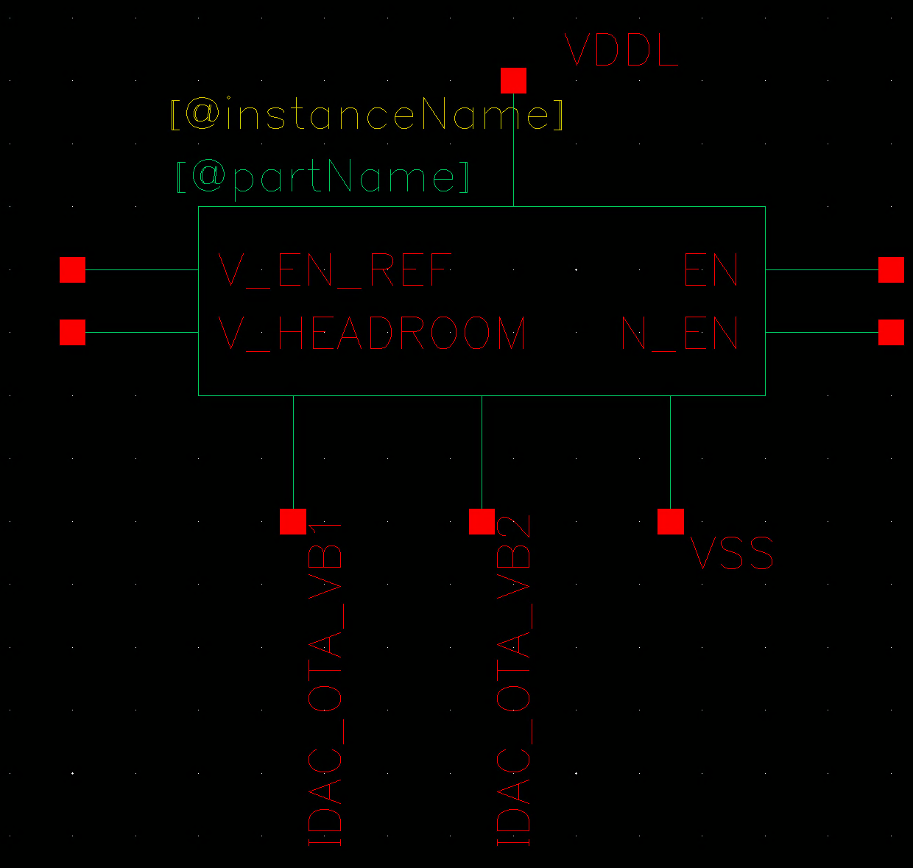
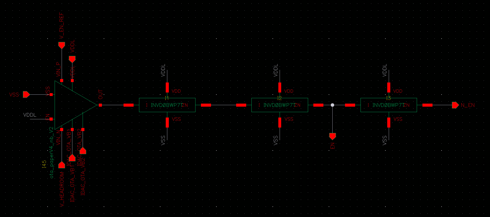

# idle_controller_nb — 空载节能控制器

> Cell: `idle_controller_nb`(实例 I108)
> 父模块:QC_rectifier_CH0。空载检测与省电。
> 来源:../../QC_rectifier_CH0_PIidleIDAC.png(symbol 级,MOS 尺寸待内部 schematic)

---

## 1. 功能

比较 **V_headroom** 与参考 **V_EN_REF(200 mV,全局)**:
- 若 V_headroom **超过** V_EN_REF → 判定本通道处于轻/空载(headroom 过剩)
  → 输出 EN/N_EN 关闭本通道的 **PI 控制器 + 比较器(comparator)**
  → 此时整流停止充电,**单通道只剩 IDAC 工作**,省电
- V_headroom 回落 ≤ 200mV 后自动恢复

> 应用场景:负载切换(电极阻抗突变)导致 headroom 瞬间过剩时,避免无谓充电浪费。

## 2. 接口



| Pin | 方向 | 连接 | 说明 |
|-----|------|------|------|
| V_HEADROOM | IN | **V_HEADROOM** 节点 | 被检测量 |
| V_EN_REF | IN | 200 mV(全局 bias) | 空载阈值 |
| IDAC\_OTA\_VB1 | IN | 全局 bias | 内部 OTA 偏置(同 IDAC/PI OTA 共享) |
| IDAC\_OTA\_VB2 | IN | 全局 bias | 内部 OTA 偏置 |
| EN | OUT | → comparator EN + PI EN(net CH0\_EN) | 使能/关断 |
| N\_EN | OUT | → comparator nEN + PI N\_EN | 反相使能 |
| VDDL / VSS | PWR | | |

## 3. 关键点
- 是 Cesc 没有的新增模块(改进点之一):高→低负载切换时的效率优化
- 关断对象是 PI + comparator(耗电的模拟环),IDAC 保留(维持电流输出)
- EN/N_EN 是本通道 comparator 与 PI 共用的开关信号

## 4. 内部结构



**结构:** OTA 比较器 + 3 级标准单元 buffer 链

```
V_HEADROOM ──┐
             OTA ── [INV] ── [INV] ── [INV/BUF] ── EN
V_EN_REF  ──┘                                    └── N_EN
```

**OTA 比较器:**
- Cell:`ota_paperV4_nb_V2`(与 IDAC 内部完全相同的 OTA cell)
- 连接:V⁺=V\_HEADROOM, V⁻=V\_EN\_REF(200mV), OUT → buffer 链
- 内部 MOS 尺寸详见:[../IDAC/sub/ota\_paperV4\_nb\_V2/ota\_paperV4\_nb\_V2.md](../IDAC/sub/ota_paperV4_nb_V2/ota_paperV4_nb_V2.md)

**Buffer 链(3 级标准单元):**
- 全部为 PDK 标准单元(INVD\_BWP7T 系列),无需记录 MOS 尺寸
- 作用:整形 + 产生 EN / N\_EN 互补输出

> 版图:33.5×30.7µm(channel 内较小单元)。

## 5. 工作原理(对外讲解版)


**一句话:** 一个 OTA 持续监测 V\_headroom,超过 200mV 阈值时立即关断 PI + comparator,避免空载时无谓充电浪费能量。

---

**① 检测逻辑**

内部 OTA(`ota_paperV4_nb_V2`,与 IDAC 完全相同的 cell):
- V⁺ = V\_HEADROOM(被监测量)
- V⁻ = V\_EN\_REF = 200mV(阈值,全局 bias 产生)
- OTA OUT → 3 级标准单元 buffer 整形 → EN / N\_EN

| 工况 | V\_HEADROOM | OTA | EN | 效果 |
|------|------------|-----|-----|------|
| 正常负载 | < 200mV | OUT 低 | EN=1 | PI + comparator 正常运行 |
| 空载/轻载 | > 200mV | OUT 高 | EN=0 | PI + comparator 关断 |

---

**② 空载场景举例**

治疗结束或电极阻抗突变 → IDAC 继续注入电流但负载消失 → Co 快速充电 → V\_headroom 超出 200mV → idle controller 检测到 → EN 拉低 → PI 停止调节、comparator 停止触发整流 → switchV8 不再开关 → **充电停止**。

IDAC 仍保持运行(EN 不控制 IDAC),维持治疗电流输出。比较器与 PI 是通道内耗电的主要模拟模块,关掉它们静态功耗大幅下降。

---

**③ 自动恢复**

负载重新接入(或电极阻抗恢复)→ IDAC 消耗 Co 电荷 → V\_headroom 下降 → 降至 ≤200mV → OTA 翻转 → EN=1 重新使能 → 闭环无缝自动恢复,不需要任何数字干预。

---

**④ OTA 共用同一 bias 的意义**

OTA 偏置 IDAC\_OTA\_VB1/VB2 与 IDAC 内部 OTA 共享:所有 OTA 的工作电流、VB1/VB2 偏置一致,温度/工艺角漂移同向 → 各 OTA 相对精度稳定,减少系统级 mismatch。

## 6. 状态
✅ symbol/接口已记(含 IDAC\_OTA\_VB1/VB2)。
✅ 内部结构框架已记(OTA + 3× 标准单元 buffer)。
✅ OTA = ota\_paperV4\_nb\_V2(同 IDAC),指针已记。
✅ 工作原理文档化。
