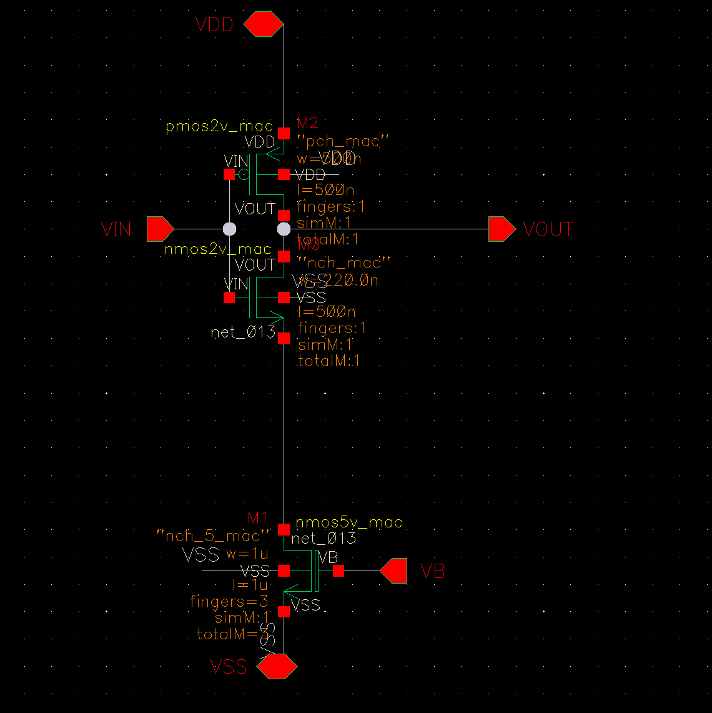

# VCDL — 压控延迟线(电流饥饿延迟)

> Cell: `VCDL_try_v4`(实例 I133)
> 父模块:QC_rectifier_CH0。相位控制链第 2 级。
> 来源:../../QC_rectifier_CH0_compVCDLNAND.png(symbol 级,MOS 尺寸待内部 schematic)

---

## 1. 功能

电流饥饿(current-starved)延迟单元。把比较器输出 V_IN 延迟 **td** 并反相,延迟量由 **PI 控制器的控制电压** 调制:
- PI 控制电压 ↑ → 饥饿电流 ↑ → td ↓ → control pulse 变窄 → Co 充电少 → V_headroom ↓
- 这是把"误差电压"转成"脉冲宽度"的核心(模拟→时域)。

延迟范围(来自笔记):粗调 33ns→10ns,细调 800ps→**170ps**(↓79% vs Cesc,支持快速 TDM 切换)。

## 2. 接口(白字 = 全局/外部 net)

| Pin | 方向 | 连接 | 说明 |
|-----|------|------|------|
| IN | IN | V_IN(comparator OUT) | 待延迟信号 |
| VB | IN | **V_C**(PI 控制器输出) | 控制饥饿电流 → td(闭环回路) |
| OUT | OUT | **V_OUT** | → NAND A2 |
| VDDL / VSS | PWR | | 1.8V / 地 |

> ✅ 控制脚 = **VB**,接 PI 控制器输出 **V_C**。闭环:PI → V_C → VCDL VB → td → pulse → 充电 → V_headroom → 回 PI。

## 3. 关键点
- V_IN(直连 NAND)与 V_OUT(经 td 延迟+反相)在 NAND 相与 → 宽度 = td 的低有效脉冲
- 延迟可调范围大决定了 headroom 调节的动态范围

## 4. 内部结构 — 电流饥饿反相器



```
VDD
 │
M2 (PMOS, gate=VIN) ─── VOUT
 │                         │
 VIN                       │
 │                         │
M3 (NMOS2V, gate=VIN) ─── VOUT
 │  net_013
M1 (NMOS5V, gate=VB) ← V_C(PI 控制)
 │
VSS
```

| 管 | 类型 | W | L | fingers | totalM | gate / 功能 |
|----|------|---|---|---------|--------|------------|
| M1 | NMOS nch\_5\_mac(5V) | 1 µm | 1 µm | 3 | 3 | gate=**VB**(=V\_C),电流饥饿管 |
| M3 | NMOS nch\_mac(2V) | 220 nm | 500 nm | 1 | 1 | gate=VIN,INV 下拉管 |
| M2 | PMOS pch\_mac(2V) | ⏳待确认 | 500 nm | 1 | 1 | gate=VIN,INV 上拉管 |

**设计要点:**

- **5V 器件 M1(nch\_5\_mac)**:Vth 远高于 2V 器件。VB=0(空载/Idle)时 M1 完全截止 → 无 VSS 通路 → 静态功耗接近 0。这是"纯动态结构"的核心。
- **L=500nm(M2/M3)**:远大于 2V 工艺最小 L(180nm),等效高 Vth + 低 gm → 反相器本身慢,与 M1 协同控制延迟范围。
- **延迟机制**:VIN 上升 → M2 截止,M3 下拉但电流受 M1 限制 → VOUT 缓慢下降 → 延迟 td = f(VB)。VB↑ → M1 电流↑ → td↓。
- **延迟范围**:粗调 33ns→10ns,细调 800ps→**170ps**(↓79% vs Cesc)。

## 5. 工作原理(对外讲解版)


**一句话:** M1(NMOS5V)串在反相器下拉路径中,用 PI 输出的控制电压 V\_C 调节放电电流,把 V\_IN 的下降沿延迟 td 后输出为 V\_OUT。

---

**① 电流饥饿结构**

M2(PMOS2V)和 M3(NMOS2V)构成一个反相器,但 M3 的 source 不直接接 VSS,而是经 net\_013 串接 M1(NMOS5V, gate=VB=V\_C)再到 VSS。M1 是"饥饿阀"——它的电流决定 M3 能从 VOUT 拉走多少电荷。

---

**② 延迟机制(非对称)**

- **V\_IN 上升(0→1)**: M2(PMOS)截止;M3(NMOS)试图拉低 VOUT,但放电电流受 M1 限制 → VOUT 缓慢下降 → 延迟 **td**。
  - V\_C 高 → M1 电流大 → VOUT 快速下降 → td 小
  - V\_C 低 → M1 电流小 → VOUT 缓慢下降 → td 大
- **V\_IN 下降(1→0)**: M2(PMOS)导通,直接从 VDD 给 VOUT 充电,**不经过 M1** → 上升沿近乎无延迟

因此 VCDL 产生的是**下降沿受控延迟**,上升沿快速。这与 NAND 联合产生控制脉冲的逻辑匹配。

---

**③ 5V 器件 → 纯动态功耗**

M1 是 nch\_5\_mac。TSMC 180nm BCD 5V NMOS 的 Vth ≈ 0.7V,远高于 2V NMOS(Vth ≈ 0.35V)。V\_C=0(Idle 或 PI 关断)时,M1 的 Vgs < Vth → 完全截止 → VOUT 到 VSS 无直流通路 → **静态功耗接近 0**。这是功耗优化阶段"返璞归真"方案的核心:不依赖偏置电流,仅靠高 Vth 天然截止。

---

**④ 在闭环中的角色**

```
PI → V_C → VCDL(VB) → td → V_AND_OUT 脉冲宽度 → switchV8 导通时间 → Co 充电量 → V_headroom → 回 PI
```

V\_C 越高 → td 越小 → 脉冲越窄 → 每周期充电越少 → V\_headroom 下降 → PI 减小 V\_C → 负反馈收敛。稳态时 V\_headroom 精确锁在 PI 参考 75mV。

## 6. 状态
✅ symbol/接口已记。
✅ M1/M3 尺寸已记;M2 L=500nm 已记,W 待确认。
✅ 工作原理文档化。
