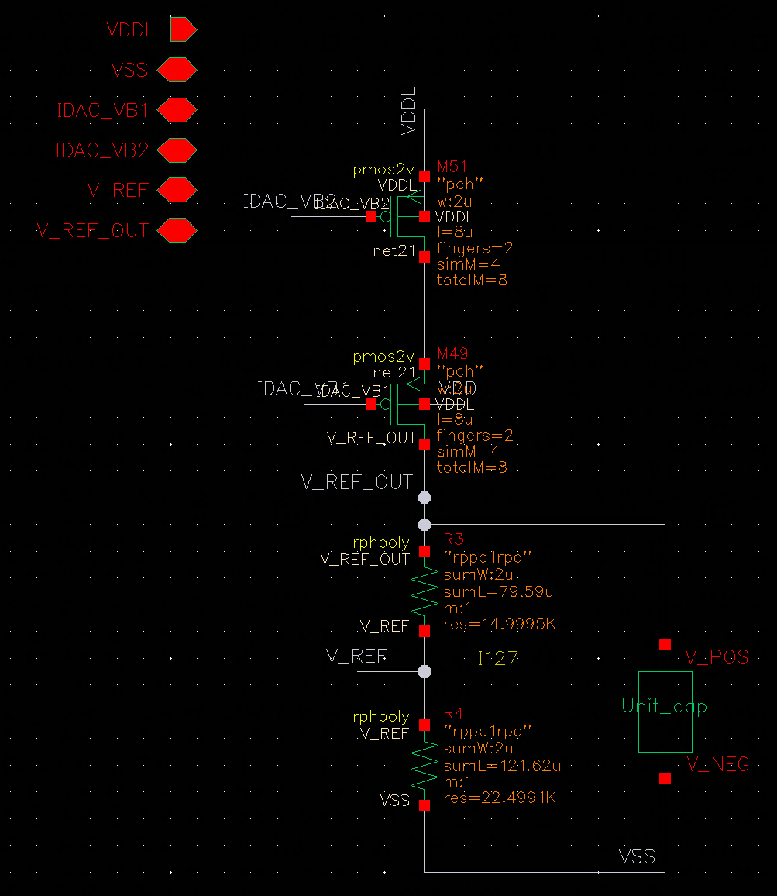

# bias_local — 通道内本地基准生成

> Cell: `bias_local`(实例 I128)
> 父模块:QC_rectifier_CH0。两级 bias 的 local 部分。
> 来源:../../QC_rectifier_CH0_biasloop.png(symbol 级,MOS 尺寸待内部 schematic)

---

## 1. 功能

从全局电流偏置 **IDAC_VB1 / IDAC_VB2** 在通道内本地生成两个最敏感的低压基准:
- **V_REF_OUT = 75 mV** → PI 控制器参考(headroom 目标)
- **V_REF = 45 mV** → IDAC drain 钳位基准

**本地化原因:** 这两个是全环最敏感的低压基准,若从全局长走线引入易受耦合噪声;
本地生成可隔离通道间干扰、保证每通道独立精度。其余 bias 仍全局分发。

## 2. 接口

| Pin | 方向 | 连接 | 说明 |
|-----|------|------|------|
| IDAC_VB1 | IN | 全局 bias | 基准电流 |
| IDAC_VB2 | IN | 全局 bias | 基准电流 |
| V_REF_OUT | OUT | → PI V_REF_OUT(75mV) | PI 参考 |
| V_REF | OUT | → IDAC V_REF(45mV) | IDAC 钳位基准 |
| VDDL / VSS | PWR | | |

## 3. 关键点
- 两级 bias 架构的 local 端:全局 bias_block_V2 给电流偏置 → bias_local 转成本地电压基准
- 75mV / 45mV 是相对 Cesc 的关键改进数字(headroom 75mV、IDAC 钳位 45mV↓82%)

## 4. 内部结构



**结构:** 两组独立 PMOS 电流镜 + 多晶硅电阻链(rpoly0d)

```
VDDL
 │
PMOS(gate=IDAC_VB2)──→ I_ref ──[R_75kΩ poly]── V_REF_OUT = 75mV ──[...]── VSS
PMOS(gate=IDAC_VB1)──→ I_ref ──[R_45kΩ poly]── V_REF     = 45mV ──[...]── VSS
```

- 参考电流由全局 IDAC\_VB1/VB2 决定(与 IDAC\_bias 尾电流同源)
- 多晶硅电阻值决定输出电压:V = I\_ref × R
  - V\_REF\_OUT ≈ 75mV → R ≈ 75kΩ(图中可见 sum ≈ 75k)
  - V\_REF ≈ 45mV → R ≈ 45kΩ(图中可见 sum ≈ 45k)
- 电阻为 PDK rpoly0d 器件,精度由工艺保证

**PMOS 电流镜管 W/L:** 图分辨率不足,待确认。

> 版图:51×50µm。

## 5. 工作原理(对外讲解版)


**一句话:** 复制全局 IDAC 参考电流,在通道内流过精密多晶硅电阻,本地产生 75mV 和 45mV 两个低压基准。

---

**① 参考电流复制**

IDAC\_VB2 和 IDAC\_VB1 是全局 bias\_block\_V2 产生的偏置(与 IDAC\_bias 的 M51/M49 尾电流同源)。bias\_local 内的 PMOS 电流镜(gate=IDAC\_VB2/VB1)在本通道内复制出 I\_ref ≈ 1µA,与全局参考电流保持镜像关系。

---

**② 电阻分压生成基准**

I\_ref 依次流过两段多晶硅电阻(rpoly0d)到 VSS:

```
VDDL
 │
PMOS 镜像(gate=IDAC_VB2) ── I_ref
 │
[R₁ ≈ 30kΩ] ── V_REF_OUT = 75mV ── [R₂ ≈ 45kΩ] ── V_REF = 45mV ── VSS
```

- V\_REF\_OUT = I\_ref × (R₁ + R₂) = 1µA × 75kΩ = **75mV** → PI 控制器参考
- V\_REF = I\_ref × R₂ = 1µA × 45kΩ = **45mV** → IDAC drain 钳位基准

多晶硅电阻精度由 TSMC 180nm BCD rpoly0d 工艺保证;两个基准使用同一镜像电流,比值(75:45 = 5:3)对温度一阶抵消,绝对精度由全局参考电流决定。

---

**③ 为什么要本地化**

75mV 和 45mV 是整个系统中最低的模拟基准。若从全局走线引入:
- 8 通道各自以 13.56MHz 开关,共用轨道噪声叠加 → mV 级干扰直接影响比较精度
- 布线电阻 × 电流 = 额外压降,精度无保证

本地生成把噪声路径缩短到通道内 µm 级 → 每通道独立精度,互不干扰。这是"两级 bias"架构的设计原因:全局 bias 负责电流偏置(对噪声不敏感),local 负责本地最敏感的电压基准。

## 6. 状态
✅ symbol/接口已记。
✅ 内部结构已记(PMOS 电流镜 + poly 电阻链)。
✅ 工作原理文档化。
⏳ PMOS 电流镜 MOS 尺寸待大图确认。
