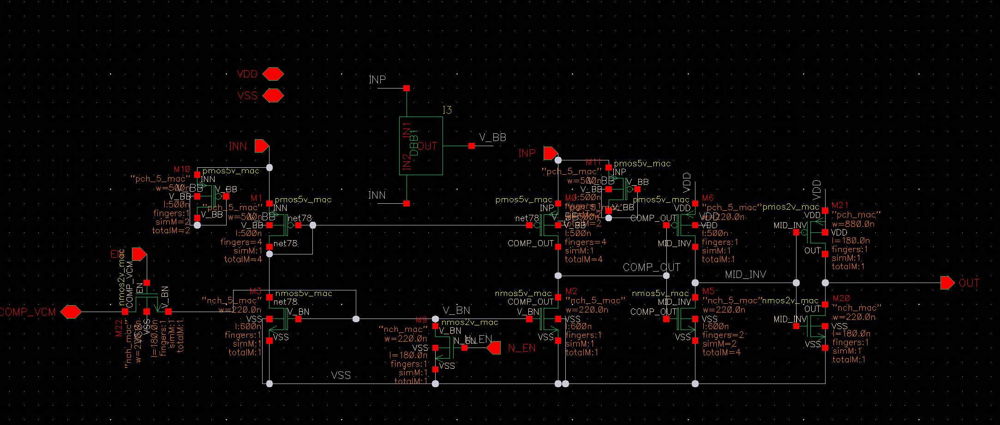

# comparator — 整流触发比较器

> Cell: `comparator_new_4_for_use_nb`(实例 I123)
> 父模块:QC_rectifier_CH0。相位控制链第 1 级。
> 来源:../../QC_rectifier_CH0_compVCDLNAND.png(symbol 级,MOS 尺寸待内部 schematic)

---

## 1. 功能

比较 **SIN_p(V_SIN)** 与 **整流输出节点 Mp_out(MP_OUT)**:
- SIN_p > Mp_out → OUT=1(V_IN=1),触发整流窗口
- SIN_p < Mp_out → OUT=0,强制关断,防止 Co 经整流管反向放电

由 Idle Controller 的 EN/nEN 控制开关(空载时关断比较器省电)。

## 2. 接口(白字 = 全局/外部 net)

| Pin | 方向 | 连接 | 说明 |
|-----|------|------|------|
| INP | IN | V_SIN | 13.56MHz 半波输入 |
| INN | IN | MP_OUT | 整流输出节点(Co 电压) |
| EN | IN | (Idle) | 使能 |
| nEN / N_EN | IN | (Idle) | 反相使能 |
| COMP_VCM | IN | 全局 bias | 比较器共模基准 |
| OUT | OUT | **V_IN** | → VCDL IN + NAND A1(直连) |
| VDDL / VSS | PWR | | 1.8V / 地 |

## 3. 关键点
- OUT(V_IN)**一路直连 NAND**,一路经 VCDL 延迟 → 二者 NAND 出脉冲(见父链路)
- 比较器速度决定整流相位精度;需在 73.8ns 半波内快速翻转

## 4. 内部结构 — Common Gate 拓扑

**拓扑:** PMOS5V 差分输入(CS)+ NMOS5V common gate 级。
5V 器件(pmos5v\_mac / nmos5v\_mac)承受 SIN 输入侧的高压摆幅,与 1.8V 逻辑域隔离。
V\_BB 为 PMOS5V 的 source 偏置(中间轨);V\_BN 为 NMOS5V common gate 偏置。

### 4.1 主体晶体管

| 管 | 类型 | W | L | fingers | totalM | gate / 功能 |
|----|------|---|---|---------|--------|------------|
| M1 | PMOS pch\_5\_mac | 500 nm | 500 nm | 4 | 4 | gate=INN,差分输入(CS) |
| M0 | PMOS pch\_5\_mac | 500 nm | 500 nm | 4 | 4 | gate=INP,差分输入(CS) |
| M3 | NMOS nch\_5\_mac | 220 nm | 600 nm | 1 | 1 | gate=V\_BN(固定),CG 级;drain=net78 |
| M2 | NMOS nch\_5\_mac | 220 nm | 600 nm | 1 | 1 | gate=V\_BN(固定),CG 级;drain=COMP\_OUT |
| M8 | NMOS nch\_mac(2V) | 220 nm | 180 nm | 1 | 1 | gate=N\_EN,EN 开关 |

> 无负反馈:原版有负反馈加速,但产生 ~80µA 静态漏电,最终去掉。改用非对称 sizing 略微弥补低压延迟。几乎纯动态功耗。

### 4.2 输出级 — 两级反相器

信号路径:**COMP\_OUT → INV1(5V) → MID\_INV → INV2(2V) → OUT**
两次取反 → OUT 与 COMP\_OUT 同相。INV1 用 5V 器件接收仍在 5V 域的 COMP\_OUT;INV2 用标准 2V 器件驱动逻辑输出。

| 管 | 类型 | W | L | fingers | totalM | 功能 |
|----|------|---|---|---------|--------|------|
| M6  | PMOS pch\_5\_mac | 220 nm | 500 nm | 1 | 1 | INV1 PMOS;gate=COMP\_OUT,drain=MID\_INV |
| M5  | NMOS nch\_5\_mac | 220 nm | 600 nm | 2 | 4 | INV1 NMOS;gate=COMP\_OUT,drain=MID\_INV |
| M21 | PMOS pch\_mac(2V) | 880 nm | 180 nm | 1 | 1 | INV2 PMOS;gate=MID\_INV,drain=OUT |
| M20 | NMOS nch\_mac(2V) | 220 nm | 180 nm | 1 | 1 | INV2 NMOS;gate=MID\_INV,drain=OUT |

> **非对称 sizing:**
> INV1:M5 totalM=4 vs M6 totalM=1 → NMOS 下拉 4× 强,加速 falling edge(弥补 5V 低压延迟)。
> INV2:M21 W=880nm vs M20 W=220nm → PMOS 上拉 4× 强,增强 OUT 高电平驱动。
> 这是去掉负反馈后补偿速度的主要手段(负反馈版有 ~80µA 静态漏电,已去除)。

## 5. 工作原理(对外讲解版)



**一句话:** SIN_p 与 MP_OUT 的电压差经 PMOS5V 差分对转为电流差,再由两级反相器整形电平后输出 V_IN,触发整流控制链。

---

**① 为什么用 5V PMOS 输入对**

M0(gate=INP=V\_SIN)和 M1(gate=INN=MP\_OUT)均为 pch\_5\_mac,source 接 V\_BB(中间轨偏置)。SIN 正半波幅值可达数 V,若用 1.8V 器件则立即击穿。5V PMOS 承受高压摆幅;V\_BB 偏置把两管拉入线性比较区,使差分输入有效。

---

**② NMOS5V common gate 负载(M3/M2)**

M3(drain=net78)和 M2(drain=COMP\_OUT)gate 固定于 V\_BN。CG 负载将 PMOS 注入的差分电流转换为 COMP\_OUT / net78 两节点间的电压差。当 SIN\_p 与 MP\_OUT 有差异时,两侧电流不平衡 → COMP\_OUT 偏向低或高 → 驱动后级反相器翻转。

---

**③ 两级反相器 + 电平转换**

```
COMP_OUT(5V 域) → INV1(M6 PMOS5V + M5 NMOS5V) → MID_INV → INV2(M21 PMOS2V + M20 NMOS2V) → OUT(V_IN, 1.8V 逻辑)
```

- **INV1**(5V 器件):承受 COMP\_OUT 仍在 5V 域的电平,完成第一次电平收敛
- **INV2**(2V 器件):输出标准 1.8V 逻辑,直接驱动 NAND 和 VCDL

两次取反 → OUT 与 COMP\_OUT 同相。

---

**④ 非对称 sizing → 速度优化(无负反馈替代方案)**

原版比较器有负反馈加速,但产生 ~80µA 静态漏电,最终去掉。改用非对称 sizing:

- **INV1**: M5 totalM=4 vs M6 totalM=1 → NMOS 拉低能力 4× → falling edge 加速
- **INV2**: M21(W=880nm) vs M20(W=220nm) → PMOS 拉高 4× → OUT 上升沿快速建立

关键边沿:COMP\_OUT 下降 → MID\_INV 上升 → OUT 下降。M5 的 4× 强驱动确保这条路径延迟最短,保证整流相位精度。

---

**⑤ EN/N\_EN 关断**

M8(NMOS2V, gate=N\_EN):N\_EN=1(空载,Idle controller 输出)→ M8 导通,短路内部节点至 VSS → 比较器完全关断,近零静态功耗。空载时只有 IDAC 维持刺激电流,PI + comparator 不消耗能量。

## 6. 状态
✅ symbol/接口已记。
✅ 全部晶体管已记(M0/M1/M2/M3/M5/M6/M8/M20/M21,M10/M11 为 dummy)。
✅ 工作原理文档化。
