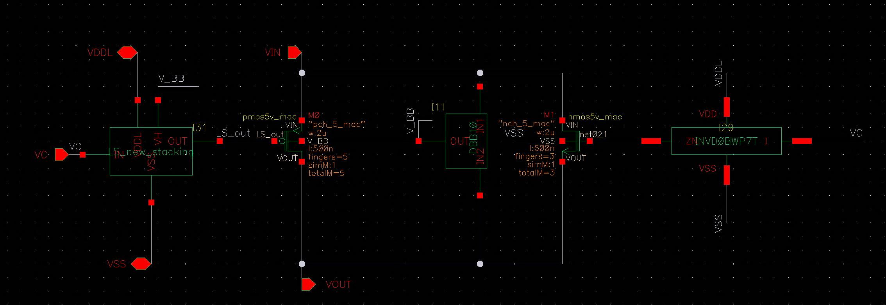

# switchV8 — 相位控制整流开关

> Cell: `switchV8`(实例 I98)
> 父模块:QC_rectifier_CH0。能量路径第 1 级(整流充电)。
> 来源:../../QC_rectifier_CH0_SWCAPHbridgeSWassign.png(symbol 级,MOS 尺寸待内部 schematic)

---

## 1. 功能

受相位控制的整流开关。NAND 给出低有效 control pulse(V_AND_OUT,宽度 = td)时开关导通,
把 SIN_p 半波能量送到 MP_OUT 节点对 Co(OUT_CAP_80p)充电。

- 高压工况:PMOS 支路导通
- 低压工况:**自动切换互补 NMOS 支路** → 低压效率 ↑~150%(vs Cesc 纯 PMOS)
- pulse 越宽 → 导通越久 → 每周期充电越多 → MP_OUT / V_headroom 越高

## 2. 接口

| Pin | 方向 | 连接 | 说明 |
|-----|------|------|------|
| VIN | IN | V_SIN | 13.56MHz 半波输入 |
| VC | IN | **V_AND_OUT**(NAND ZN) | 低有效 control pulse(td 宽) |
| VOUT | OUT | **MP_OUT** | → Co V_POS + H_bridge V_SUPPLY |
| VDDL / VSS | PWR | | 1.8V / 地 |

## 3. 关键点
- VOUT(MP_OUT)= Co 储能节点 = 8 个 H_bridge 的共享电源轨
- 互补 PMOS/NMOS 结构是相对基线的核心整流效率改进之一

## 4. 内部结构 — 互补 PMOS/NMOS 功率开关



**信号路径:**VC(1.8V 逻辑)→ Level Shifter → 5V 域驱动 → PMOS/NMOS 功率管 gate

| 管 | 类型 | W | L | fingers | totalM | 功能 |
|----|------|---|---|---------|--------|------|
| M1(PMOS) | pmos5v\_mac "pch\_5\_mac" | 2 µm | 500 nm | 5 | 5 | 主整流开关;source=VIN(SIN\_p),drain=VOUT(MP\_OUT) |
| M(NMOS) | nmos5v\_mac "nch\_5\_mac" | 2 µm | 500 nm | 3 | 3 | 互补 NMOS;低压工况补充导通路径 |

> 有效宽度:PMOS = 2µm×5 = **10µm**;NMOS = 2µm×3 = **6µm**。
> PMOS 用 5f 补偿空穴迁移率低(vs NMOS 电子迁移率),两管有效电流能力近似。
> 5V 器件用于承受 SIN 输入侧高压摆幅,与 1.8V 逻辑域隔离。
> Level Shifter 为子 cell(将 1.8V VC 提升到 5V 域驱动 PMOS gate)。

> ⚠️ 设计笔记记录的 W=6µm/L=600nm 为早期版本;**以电路图实测值为准**:W=2µm/L=500nm。

## 5. 工作原理(对外讲解版)


**一句话:** 受 NAND 脉冲控制的互补功率开关,把 SIN\_p 半波能量按需送入 Co;互补 NMOS 在低压工况自动补充导通,将整流效率提升约 2×。

---

**① Level Shifter:控制信号升压**

VC 来自 NAND(1.8V 逻辑)。但功率管是 5V 器件,gate drive 必须在 5V 域才能完全开关。左侧 Level Shifter 子块:
- 输入:VC(1.8V)+ V\_BB(5V 偏置)
- 输出:5V 域的 la\_out → 驱动 PMOS/NMOS gate

---

**② 主 PMOS 整流(高压工况)**

M1(pch\_5\_mac, 10µm 有效宽度):VC 低有效 → Level Shifter 输出使 M1 gate 拉低 → M1 ON → 电流从 SIN\_p(VIN)流向 MP\_OUT(VOUT),对 Co 充电。

5V 器件必要性:SIN 正半波可达数 V,若用 1.8V PMOS 则 source-drain 或 gate-source 击穿。pch\_5\_mac 耐压保证可靠性。

---

**③ 互补 NMOS(低压工况自动介入)**

当 V\_headroom 低(Co 电压低 < ~0.5V 时),SIN 正半波幅值相对较小。此时:
- PMOS M1:source=SIN\_p 与 drain=MP\_OUT 压差小 → |Vgs| 不足 → 导通电阻高 → 效率差
- NMOS(nch\_5\_mac, 6µm 有效宽度):NMOS 在低 Vds 下反向导通能力强(电子迁移率 ~2× 空穴)→ 自动补充 → 低压效率提升约 2×

NMOS 比 PMOS 小(3f vs 5f):NMOS 迁移率高,同等电流不需要那么大的 W。

---

**④ 脉冲宽度 = 充电量**

每个 13.56MHz 周期(73.8ns):switchV8 仅在 V\_AND\_OUT 低电平期间(宽度 = td,由 VCDL 决定)导通。

```
脉冲宽(td 大) → 导通时间长 → Co 充电多 → V_headroom 升
脉冲窄(td 小) → 导通时间短 → Co 充电少 → V_headroom 降
```

PI 闭环调节 V\_C → VCDL td → 脉冲宽度,把 V\_headroom 锁在 75mV。switchV8 是这条调节链的**执行末端**:把模拟控制量(脉冲宽度)转换为实际充电能量。

## 6. 状态
✅ symbol/接口已记。
✅ 功率管 MOS 尺寸已记(PMOS 5f / NMOS 3f,均 2µm/500nm)。
✅ 工作原理文档化。
